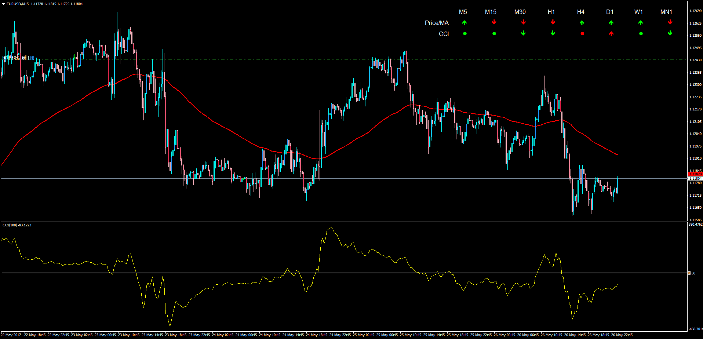

# MTF CCI MA [With Alerts]

> Source: https://fxcodebase.com/code/viewtopic.php?f=38&t=64692  
> Forum: 38 · Topic 64692 · 1 post(s)

---

## MTF CCI MA [With Alerts]

**Apprentice** · Mon May 29, 2017 6:14 am

LUA Original: [viewtopic.php?f=17&t=34000](https://fxcodebase.com/code/viewtopic.php?f=17&t=34000)

Description:

This indicator analyzed the position of price with a determined moving average in a multi time frame mode and also the position of the CCI in regards of buying and selling levels also in MTF mode.

Arrows and colors meaning are like follows:

- Green means positive slope
- Red means negative slope
- Up Arrow means price above MA and CCI above buying level
- Down Arrow means price below MA and CCI below selling level

The indicator contemplates the case when all the Time Frames are in sync for either direction and will print an indication in that case with an optional alert.

 [MTF_CCI_MA.mq4](files/112613/MTF_CCI_MA.mq4)
