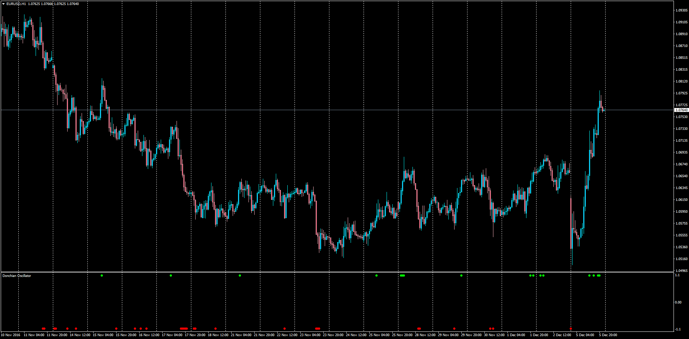

# MTF Donchian Oscillator

> Source: https://fxcodebase.com/code/viewtopic.php?f=38&t=64177  
> Forum: 38 · Topic 64177 · 1 post(s)

---

## MTF Donchian Oscillator

**Apprentice** · Tue Dec 06, 2016 4:04 am

 [Donchian_Oscillator_Heat_Map.mq4](files/109538/Donchian_Oscillator_Heat_Map.mq4)

LUA Original: [viewtopic.php?f=17&t=2570](https://fxcodebase.com/code/viewtopic.php?f=17&t=2570)

Description:

Included are both the Donchian Oscillator for the current chart and also the multi time frame representation of the same concept that goes like this:

If Close>max of previous [Period] Bars Oscillator=1
If Close<min of previous [Period] Bars Oscillator=-1

 [Donchian_Oscillator.mq4](files/109538/Donchian_Oscillator.mq4)

 [Donchian_Oscillator_Heat_Map.mq4](files/109538/Donchian_Oscillator_Heat_Map%20%282%29.mq4)
