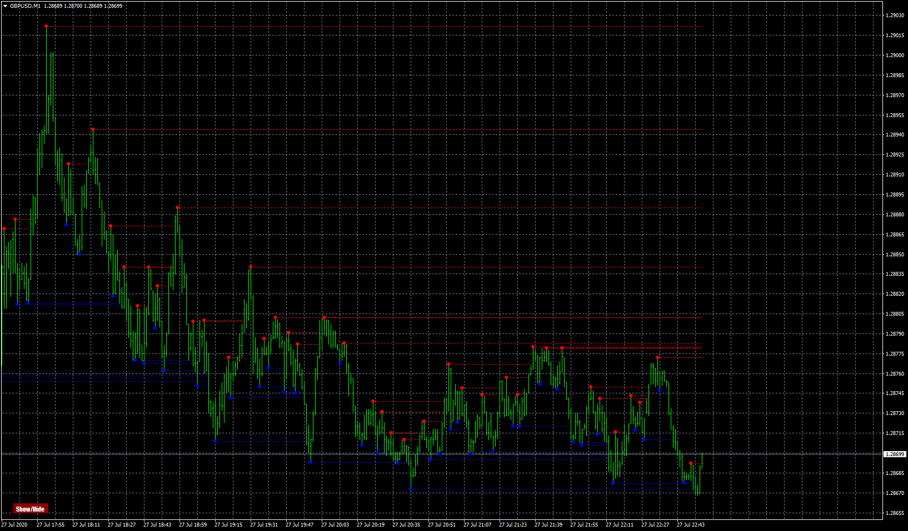

# MTF Fractal

> Source: https://fxcodebase.com/code/viewtopic.php?f=38&t=70232  
> Forum: 38 · Topic 70232 · 4 post(s)

---

## MTF Fractal

**Apprentice** · Mon Jul 27, 2020 4:40 pm

Based on request.
[viewtopic.php?f=27&t=70223](https://fxcodebase.com/code/viewtopic.php?f=27&t=70223)

 [MTF Fractal.mq4](files/136342/MTF%20Fractal.mq4)

---

## Re: MTF Fractal

**PURABI** · Tue Sep 01, 2020 12:48 pm

Extended fractal lines should extend to the latest price and time

---

## Re: MTF Fractal

**Apprentice** · Wed Sep 02, 2020 2:38 am

Your request is added to the development list.
Development reference 1958.

---

## Re: MTF Fractal

**Apprentice** · Tue Sep 08, 2020 3:56 am

[MTF Fractal.mq4](files/137423/MTF%20Fractal.mq4)

Try this version.
