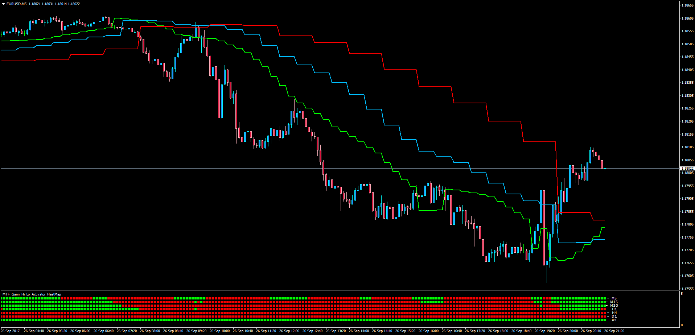

# MTF Gann Hi Lo Activator HeatMap

> Source: https://fxcodebase.com/code/viewtopic.php?f=38&t=65121  
> Forum: 38 · Topic 65121 · 9 post(s)

---

## MTF Gann Hi Lo Activator HeatMap

**Apprentice** · Wed Sep 27, 2017 5:10 am

Lua Original: [viewtopic.php?f=17&t=2610](https://fxcodebase.com/code/viewtopic.php?f=17&t=2610)

Description:

In this MT4 version of the LUA original, the trader can view the HeatMap of the position of price in regards of the MTF Gann Hi Lo Activators. The more time frames agreeing with the direction of a trade the more valuable the decision to buy or sell becomes.

 [MTF_Gann_Hi_Lo_Activator_HeatMap.mq4](files/115115/MTF_Gann_Hi_Lo_Activator_HeatMap.mq4)

---

## Re: MTF Gann Hi Lo Activator HeatMap

**Chatagny** · Thu Feb 21, 2019 12:08 pm

Hello everyone. It is my first time here. I found MTF HeatMap and I just want to know if this indicator repait? Because The color of the square change in the past. So I can not say if I can use it to filter my others indicators.
Thank you

---

## Re: MTF Gann Hi Lo Activator HeatMap

**Apprentice** · Thu Feb 21, 2019 2:10 pm

Sure.
If Underlining indicator indication changes.
Will be the case with higher time frames.
Higher time frames affect more candles on lower time frame.

---

## Re: MTF Gann Hi Lo Activator HeatMap

**Chatagny** · Thu Feb 21, 2019 3:54 pm

> **Apprentice wrote:**
> Sure.
> If Underlining indicator indication changes.
> Will be the case with higher time frames.
> Higher time frames affect more candles on lower time frame.

Ok I see. So, I trade in M15. I should look only when the market cross and close up or down Gann in 15 and 30 mn I think?
I am looking for a trend indicator who doesn't repaint. Do you have an idea? I need one who can confirm an indicator that I already have.
If you an help me it could be so good.
Have fun
Pierre

---

## Re: MTF Gann Hi Lo Activator HeatMap

**Apprentice** · Mon Feb 25, 2019 6:00 pm

Answered via email.

---

## Re: MTF Gann Hi Lo Activator HeatMap

**Kinslay** · Mon Dec 04, 2023 2:02 pm

Hello Apprentice,

Is it possible to have the HeatMap for the mt5 platform?
Also can you add this indicator as well so it can be used with mt5?

[https://fxcodebase.com/code/viewtopic.p ... or#p106453](https://fxcodebase.com/code/viewtopic.php?f=38&t=63522&p=106453&hilit=Gann+Hi+Lo+Activator#p106453)

Regards

> **Apprentice wrote:**
>
>
> MTF_Gann_Hi_Lo_Activator_HeatMap.png
>
>
> Lua Original: [viewtopic.php?f=17&t=2610](https://fxcodebase.com/code/viewtopic.php?f=17&t=2610)
>
> Description:
>
> In this MT4 version of the LUA original, the trader can view the HeatMap of the position of price in regards of the MTF Gann Hi Lo Activators. The more time frames agreeing with the direction of a trade the more valuable the decision to buy or sell becomes.
>
>
> MTF_Gann_Hi_Lo_Activator_HeatMap.mq4

---

## Re: MTF Gann Hi Lo Activator HeatMap

**Apprentice** · Tue Dec 05, 2023 6:56 am

We have added your request to the development list.
Development reference 1066

---

## Re: MTF Gann Hi Lo Activator HeatMap

**Kinslay** · Fri Dec 22, 2023 3:23 am

> **Apprentice wrote:**
> We have added your request to the development list.
> Development reference 1066

Hello Apprentice,

Any news about the request?

Regards

---

## Re: MTF Gann Hi Lo Activator HeatMap

**Apprentice** · Mon Aug 25, 2025 3:51 am

 [GHLA_Touchline.mq5](files/160350/GHLA_Touchline.mq5)

 [MTF_Gann_Hi_Lo_Activator_HeatMap.mq5](files/160350/MTF_Gann_Hi_Lo_Activator_HeatMap.mq5)
