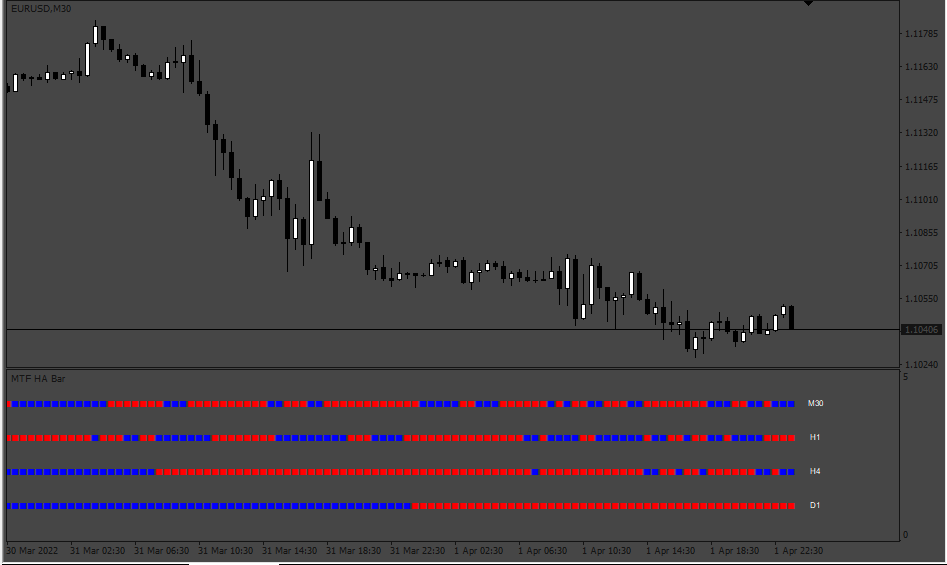

# MTF_HA_3Bars

> Source: https://fxcodebase.com/code/viewtopic.php?f=38&t=72085  
> Forum: 38 · Topic 72085 · 5 post(s)

---

## MTF_HA_3Bars

**Apprentice** · Wed Apr 13, 2022 11:47 am

Based on the request.
[https://fxcodebase.com/code/viewtopic.php?f=27&p=145608](https://fxcodebase.com/code/viewtopic.php?f=27&p=145608)

 [MTF_HA_3Bars.mq4](files/145669/MTF_HA_3Bars.mq4)

---

## Re: MTF_HA_3Bars

**logicgate** · Wed Apr 13, 2022 3:28 pm

Brilliant! Gonna test it.

---

## Re: MTF_HA_3Bars

**logicgate** · Tue Apr 19, 2022 7:16 am

Dear friend Apprentice, the request was for MT5, you did this for MT4. Please give us a MT5 version.

Also, you can remove completely from the code and indicator options that "Auto Display" option which is useless.

Best regards

---

## Re: MTF_HA_3Bars

**Apprentice** · Tue Apr 19, 2022 9:10 am

Your request is added to the development list.
Development reference 240.

---

## Re: MTF_HA_3Bars

**logicgate** · Fri May 06, 2022 6:19 am

Hello buddy, any update on this one too?
