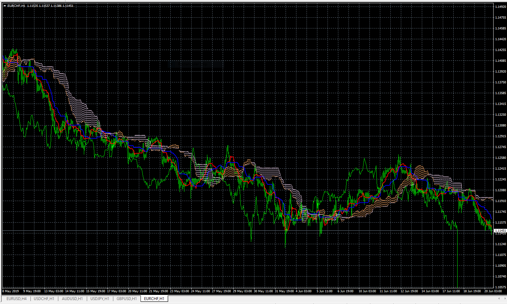
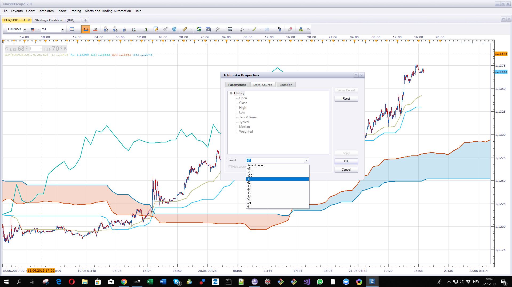
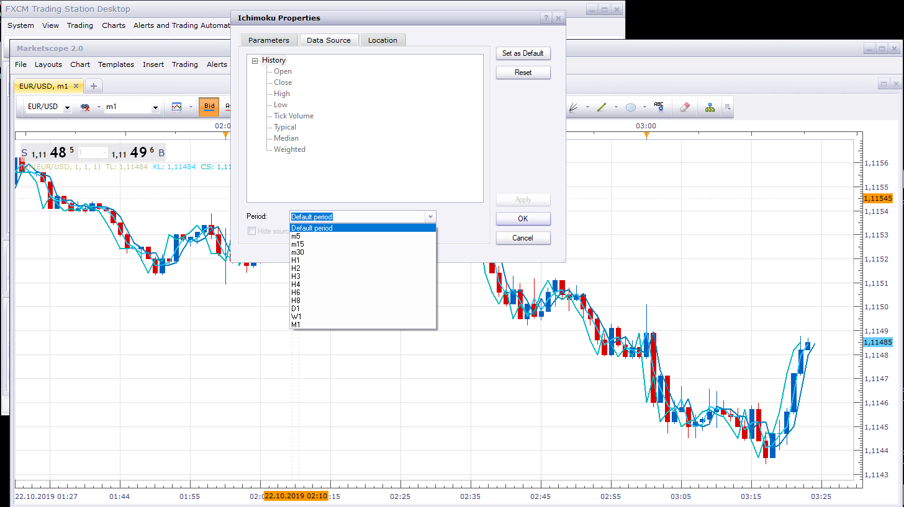

# MTF ICH

> Source: https://fxcodebase.com/code/viewtopic.php?f=38&t=68588  
> Forum: 38 · Topic 68588 · 15 post(s)

---

## MTF ICH

**Apprentice** · Thu Jun 20, 2019 7:48 am

 [MTF ICH.mq4](files/127004/MTF%20ICH.mq4)

---

## Re: MTF ICH

**armin0012003** · Fri Jun 21, 2019 9:05 am

hi man thanks for this but I have mt4 indicator that's why I give you source cod
I need this for trading station

---

## Re: MTF ICH

**Apprentice** · Sat Jun 22, 2019 5:42 am

On Trading Station, You can have a higher time frame ICH by selecting a higher time frame source.

---

## Re: MTF ICH

**armin0012003** · Sat Jun 22, 2019 12:57 pm

Hi yes I know that but the calculation is wrong for the job I have
can you please convert this indicator for trading station

---

## Re: MTF ICH

**armin0012003** · Sat Jun 22, 2019 2:00 pm

for example I did put 6 for kj for 1h then I did go to 5min
you cant get this calculation on normal ichi

---

## Re: MTF ICH

**armin0012003** · Mon Jun 24, 2019 10:18 am

Hi
so is this going to be made for trading station ?

---

## Re: MTF ICH

**Apprentice** · Mon Jun 24, 2019 12:08 pm

Still, have a problem understanding what is required.

---

## Re: MTF ICH

**armin0012003** · Mon Jun 24, 2019 12:43 pm

Hi
my request is if its possible change this ichi mtf for trading station.

---

## Re: MTF ICH

**armin0012003** · Thu Jun 27, 2019 4:52 am

so is this going to be made or not?

---

## Re: MTF ICH

**armin0012003** · Sat Oct 19, 2019 1:02 pm

hi can you please make this for trading station ?

---

## Re: MTF ICH

**Apprentice** · Sun Oct 20, 2019 3:36 am

Your request is added to the development list.
Development reference 217.

---

## Re: MTF ICH

**Apprentice** · Mon Oct 21, 2019 5:20 am

it's identical to the built-in ICH indicator in the FXTS2

---

## Re: MTF ICH

**armin0012003** · Mon Oct 21, 2019 5:33 am

Hi
if its identical can you please show me how to get this setup on fxts2?
for example on mt4 mtf ichi I put 1 hr and put 1 for tenknsen now I come to 5 min chart now I have flat with 12 candles
you can not get this setup on fxts2

---

## Re: MTF ICH

**armin0012003** · Mon Oct 21, 2019 5:34 am

forgot to add photos

---

## Re: MTF ICH

**Apprentice** · Tue Oct 22, 2019 4:17 am

