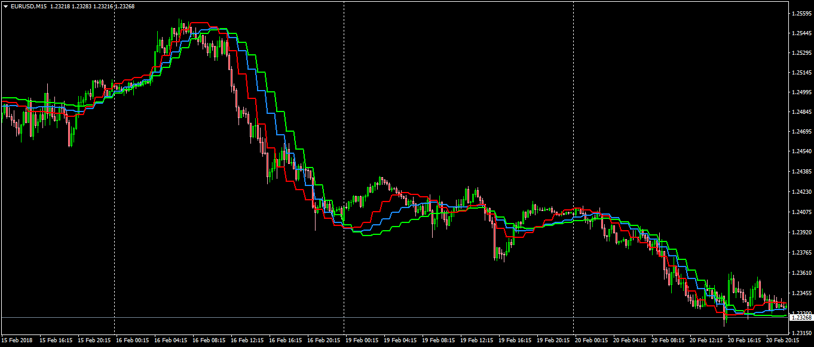

# MTF MA Channel

> Source: https://fxcodebase.com/code/viewtopic.php?f=38&t=65779  
> Forum: 38 · Topic 65779 · 1 post(s)

---

## MTF MA Channel

**Apprentice** · Tue Feb 27, 2018 4:59 pm

LUA Original: [viewtopic.php?f=17&t=3786](https://fxcodebase.com/code/viewtopic.php?f=17&t=3786)

Description:

This is a MTF MT4 version of the LUA original indicator that draws two additional Moving Averages from the one selected, according to a selected step.

There are 17 different types of moving average from where to choose and with the capability to observe a higher time frame within the current chart.

 [MTF_MA_Channel.mq4](files/117940/MTF_MA_Channel.mq4)
