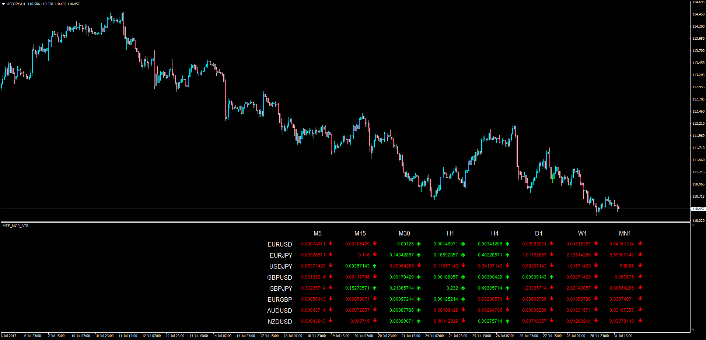

# MTF MCP ATR Dashboard

> Source: https://fxcodebase.com/code/viewtopic.php?f=38&t=64955  
> Forum: 38 · Topic 64955 · 1 post(s)

---

## MTF MCP ATR Dashboard

**Apprentice** · Mon Jul 31, 2017 2:49 pm

LUA Original: [viewtopic.php?f=17&t=2723](https://fxcodebase.com/code/viewtopic.php?f=17&t=2723)

Description:

This indicator is the MT4 version of the LUA original and it shows the value of an ATR for the currency pair, in several time frames.

The colors vary according whether the current ATR for that Pair/TF is higher or lower than the previous candle ATR.

 [MTF_MCP_ATR.mq4](files/113892/MTF_MCP_ATR.mq4)
