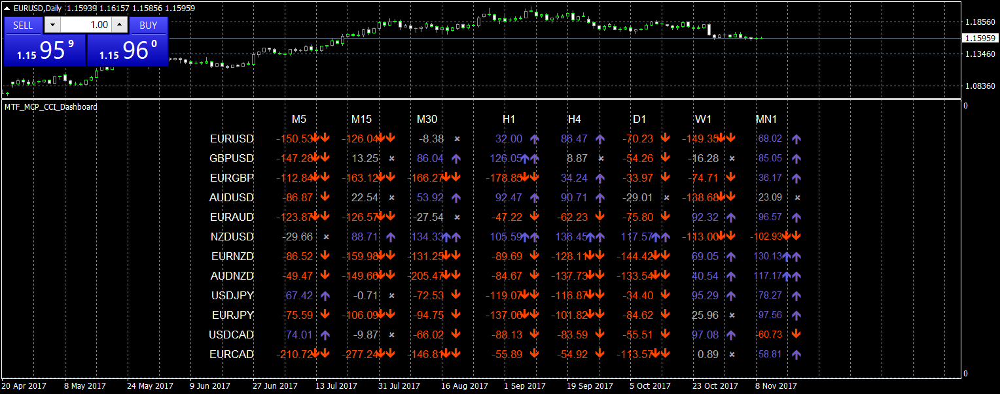

# MTF_MCP_CCI_Dash

> Source: https://fxcodebase.com/code/viewtopic.php?f=38&t=65346  
> Forum: 38 · Topic 65346 · 8 post(s)

---

## MTF_MCP_CCI_Dash

**Se7enTrader** · Wed Nov 08, 2017 10:47 pm

Can i give you a contribute? I hope so.
Here came CCI Dashboard with some setting parameters that help you to shot your market.
Please remember my [previous request](https://fxcodebase.com/code/viewtopic.php?f=38&t=65343#p115913), i'd like try to implement inside.
Stay tuned

---

## Re: MTF_MCP_CCI_Dash

**andyy1** · Sun Aug 02, 2020 10:26 pm

can u add alert push notifications please..thanks

---

## Re: MTF_MCP_CCI_Dash

**andyy1** · Sun Aug 02, 2020 10:42 pm

please add alert push notification while it does cross +100 or -100 in like 4h time frame etc..thanks

---

## Re: MTF_MCP_CCI_Dash

**Apprentice** · Mon Aug 03, 2020 9:16 am

Your request is added to the development list.
Development reference 1820.

---

## Re: MTF_MCP_CCI_Dash

**Apprentice** · Tue Aug 04, 2020 5:04 am

[MTF_MCP_CCI_Dashboard.mq4](files/136573/MTF_MCP_CCI_Dashboard.mq4)

Try this version.

---

## Re: MTF_MCP_CCI_Dash

**andyy1** · Wed Aug 05, 2020 12:14 am

thanks. but push notificaton not working but pop up working though also when cross and enter into let say 4h +100 or -100 this way does not work.

should be like let say whenever any symbol crosses into +100 or -100 into any time frame or 4h msg should sent. thanks

---

## Re: MTF_MCP_CCI_Dash

**Apprentice** · Wed Aug 05, 2020 4:11 am

Your request is added to the development list.
Development reference 1827.

---

## Re: MTF_MCP_CCI_Dash

**Apprentice** · Thu Aug 06, 2020 5:41 am

It works exactly like that. I have no issues with it.
