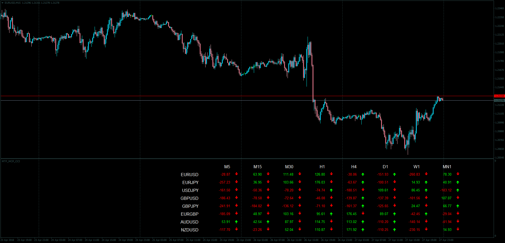

# MTF MCP CCI

> Source: https://fxcodebase.com/code/viewtopic.php?f=38&t=65976  
> Forum: 38 · Topic 65976 · 1 post(s)

---

## MTF MCP CCI

**Apprentice** · Tue May 01, 2018 6:07 am

LUA Original: [viewtopic.php?f=17&t=7337](https://fxcodebase.com/code/viewtopic.php?f=17&t=7337)

Description:

In this MT4 version of the LUA Original Dashboard, it is visualized the CCI value of different Currency Pairs within their time frames.

The color of the value represents:

- Green: Above the OB Level
- Red: Below the OS Level
- Gray: Not in OBOS area

The color of the arrow is an indication of the slope, whether it is positive or negative.

 [MTF_MCP_CCI.mq4](files/118900/MTF_MCP_CCI.mq4)
