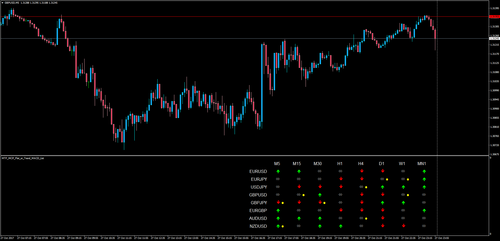

# MTF MCP Flat or Trend MACD List

> Source: https://fxcodebase.com/code/viewtopic.php?f=38&t=65313  
> Forum: 38 · Topic 65313 · 1 post(s)

---

## MTF MCP Flat or Trend MACD List

**Apprentice** · Sun Oct 29, 2017 5:08 am

LUA Original: [viewtopic.php?f=17&t=1719](https://fxcodebase.com/code/viewtopic.php?f=17&t=1719)

Description:

This List, which is a MT4 version of the LUA original, allows to see in one single place whether a timeframe is trending or not. Multiple TFs at once and multiple currency pairs as well. The yellow dot indicates if the MACD and the Signal are crossing in real time (current bar).

The trend or flat conditions are as follow:

if SignalMACD<MACD and MACD>0 then indicator show up trend,
if SignalMACD>MACD and MACD<0 then indicator show down trend
else indicator show flat.

 [MTF_MCP_Flat_or_Trend_MACD_List.mq4](files/115739/MTF_MCP_Flat_or_Trend_MACD_List.mq4)
