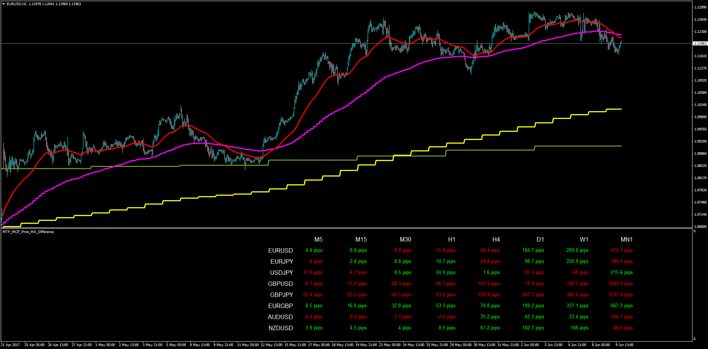

# MTF MCP MA Difference

> Source: https://fxcodebase.com/code/viewtopic.php?f=38&t=64777  
> Forum: 38 · Topic 64777 · 4 post(s)

---

## MTF MCP MA Difference

**Apprentice** · Mon Jun 12, 2017 4:28 am

LUA Original: [viewtopic.php?f=17&t=37544](https://fxcodebase.com/code/viewtopic.php?f=17&t=37544)
Description:
This is the MT4 version of the LUA Original indicator that displays the difference in pips of the current price of Multi Currency Pairs in regards of the Moving Average of Multiple Time Frames. This is a very handy indicator because at one glance you can have a lot of information about the position of the market in each case and how close/far away from the MA's price is.

 [MTF_MCP_Price_MA_Difference.mq4](files/112830/MTF_MCP_Price_MA_Difference.mq4)

---

## Re: MTF MCP MA Difference

**maclaud** · Sun Jun 30, 2019 8:47 am

Hi, firstly i would like give thank you for all amazing and hard work you doing here. It's impressive!
If a posible please add second ma for cross diff + tf 1minut & support suffix pair for future

---

## Re: MTF MCP MA Difference

**Apprentice** · Sun Jun 30, 2019 5:48 pm

Your request is added to the development list under Id Number 4754

---

## Re: MTF MCP MA Difference

**Apprentice** · Wed Jul 03, 2019 1:39 pm

[MTF_MCP_Two_MA_Difference.mq4](files/127212/MTF_MCP_Two_MA_Difference.mq4)

Try this version.
