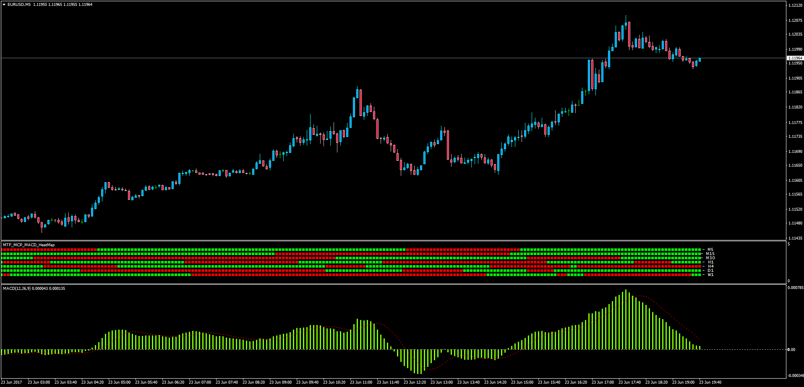

# MTF MCP MACD Heatmap

> Source: https://fxcodebase.com/code/viewtopic.php?f=38&t=64837  
> Forum: 38 · Topic 64837 · 1 post(s)

---

## MTF MCP MACD Heatmap

**Apprentice** · Sat Jun 24, 2017 3:41 am

LUA Original: [viewtopic.php?f=17&t=23823](https://fxcodebase.com/code/viewtopic.php?f=17&t=23823)

Description:

This is the MT4 version of the LUA Original, a multi time frame multi currency pairs MACD Indicator.

Also you can select the desired Time frame and currency pair.

Enables you to choose between the three algorithms:

MACD / Signal Line, MACD / Zero Line, Histogram / ​​Zero Line.

 [MTF_MCP_MACD_HeatMap.mq4](files/113095/MTF_MCP_MACD_HeatMap.mq4)
