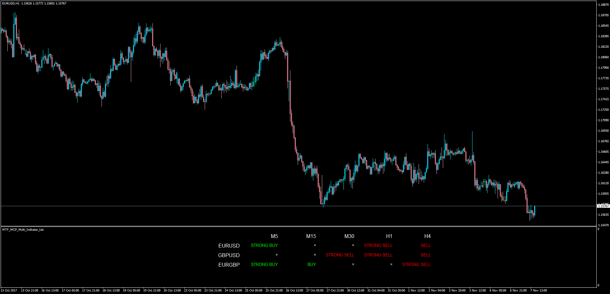

# MTF MCP Multi Indicator List

> Source: https://fxcodebase.com/code/viewtopic.php?f=38&t=65344  
> Forum: 38 · Topic 65344 · 1 post(s)

---

## MTF MCP Multi Indicator List

**Apprentice** · Tue Nov 07, 2017 1:23 pm

LUA Original: [viewtopic.php?f=17&t=44162](https://fxcodebase.com/code/viewtopic.php?f=17&t=44162)

Description:

This is a MT4 representation of a concept originally implemented in LUA. What this indicator does is to present which currency pair and on which timeframe there is a trend and if it's strong.

A word of caution: since there are 20 different indicator analysis being made at the same time for each currency pair and each TF, the use of resources is high. For that reason, the indicator updates every 60 seconds (this is customizable). And also the number of currency pairs can be customized as well as the assessed timeframes.

Also note: You need to place the Stochastic RSI indicator included here within the same folder.

Indicator conditions:

1.stochastic with default parameters
ob level 80
os level 20
k>d and k<ob level=====score +1
k<d and k>os level ===score -1
k>d and k>ob level=====score 0
k<d and k<os level ===score 0

2.rsi period 14
buy level :50
sell level :50
rsi>buy level====score +1
rsi<sell level ===score-1

3.cci period14
buy level==0
sell level==0

cci>buy level ----score +1
cci<sell level----score -1

4.williams ossilator:(%larry willlams RLW)

buy level:-50
sell level:-50
ob level:-20
os level:-80

williams ossilator>buy level and <ob level ==== score+1
williams ossilator<sell level and >os level ==== score -1
williams ossilator>buy level and >ob level ==== score 0
williams ossilator<sell level and <os level ==== score 0

5.BULLS AND BEARS IMPULSE:

IMPULSE>0----SCORE 1
IMPULSE<0---SCORE-1

6.MACD WITH DEFAULT PARAMETER

MACD>0-----SCORE+1
MACD<0----SCORE-1

7.ADX AND DMI WITH DEFAULT PARAMETER

ENTRY LEVEL:25

ADX> ENTRY LEVEL AND DMI POSITIVE>DMI NEGATIVE =====SCORE +1
ADX< ENTRY LEVEL AND DMI NEGATIVE> DMI POSITIVE=====SCORE -1

8.STOCHASTIC RSI WITH DEAULT PARAMETERS
(Indicator included here)

OB LEVEL:80
OS LEVEL:20

K>D AND K<OB LEVEL ----SCORE+1
K<D AND K>OS LEVEL---- SCORE-1
K>D AND K>OB LEVEL ----SCORE 0
K<D AND K<OS LEVEL---- SCORE 0

MOVING AVERAGES:

1. MVA 5,10,20,50,100,200
PRICE > MVA ---- SCORE+1
PRICE<MVA-----SCORE-1

2.EMA 5,10.20.50,100,200
PRICE >EMA--- SCORE +1
PRICE <EMA ----SCORE -1

MAXIMUM SCORE WILL BE 20

STRONG BUY WHEN SCORE >+15
BUY WHEN SCORE> +12
STRONG SELL WHEN SCORE <-15
SELL WHEN SCORE<-12
NEUTRAL SCORE <12 AND SCORE>-12

 [Stochastic_RSI.mq4](files/115915/Stochastic_RSI.mq4)

 [MTF_MCP_Multi_Indicator_List.mq4](files/115915/MTF_MCP_Multi_Indicator_List.mq4)
