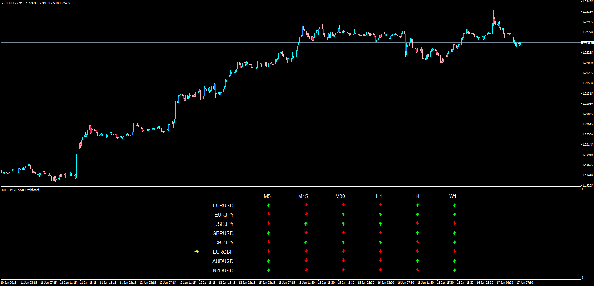

# MTF MCP SAR Dashboard

> Source: https://fxcodebase.com/code/viewtopic.php?f=38&t=65641  
> Forum: 38 · Topic 65641 · 1 post(s)

---

## MTF MCP SAR Dashboard

**Apprentice** · Wed Jan 17, 2018 8:49 am

LUA Original: [viewtopic.php?f=17&t=64429](https://fxcodebase.com/code/viewtopic.php?f=17&t=64429)

Description:

This is the MT4 version of the LUA original Dashboard that looks for the position of price according to the Parabolic SAR in multiple time frames across multiple currency pairs.

When all the time frames are aligned in the same direction for one pair an alert will be given.

 [MTF_MCP_SAR_Dashboard.mq4](files/117087/MTF_MCP_SAR_Dashboard.mq4)
