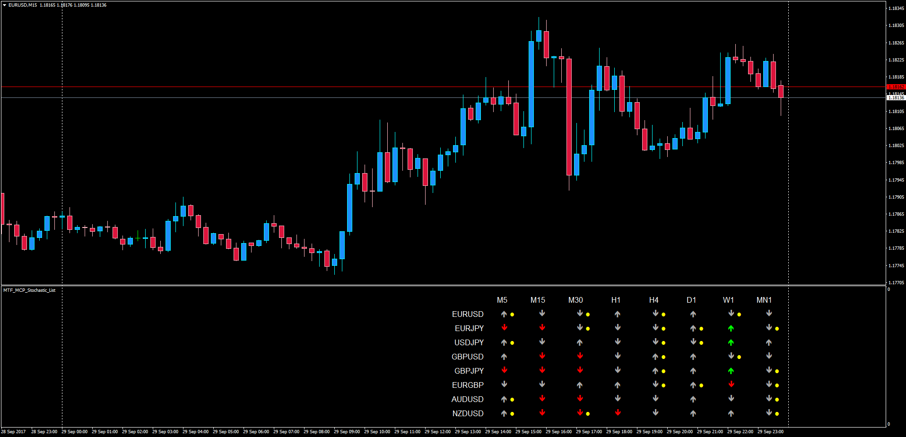

# MTF MCP Stochastic List

> Source: https://fxcodebase.com/code/viewtopic.php?f=38&t=65135  
> Forum: 38 · Topic 65135 · 1 post(s)

---

## MTF MCP Stochastic List

**Apprentice** · Sun Oct 01, 2017 4:18 am

LUA Original: [viewtopic.php?f=17&t=60997](https://fxcodebase.com/code/viewtopic.php?f=17&t=60997)

Description:

This is the MT4 version of the LUA original. In this version, the same parameters stochastic is analyzed within the different timeframes of the chosen currency pairs.

- An Up arrow is produced when the Stoch K > Stoch D; it is colored Green when it's above the OB Level
- A Down arrow is produced when the Stoch K < Stoch D; it is colored Red when it's below the OS Level
- If a cross between the Stoch K and Stoch D is observed in the current TF candle then a yellow dot will be printed as well

 [MTF_MCP_Stochastic_List.mq4](files/115184/MTF_MCP_Stochastic_List.mq4)
