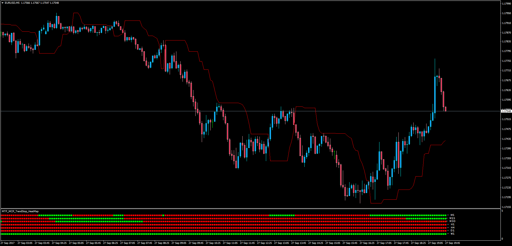

# MTF MCP TrendStop HeatMap

> Source: https://fxcodebase.com/code/viewtopic.php?f=38&t=65127  
> Forum: 38 · Topic 65127 · 1 post(s)

---

## MTF MCP TrendStop HeatMap

**Apprentice** · Fri Sep 29, 2017 4:21 am

LUA Original: [viewtopic.php?f=17&t=60550](https://fxcodebase.com/code/viewtopic.php?f=17&t=60550)

Description:

This Heat Map will show the position of price above or below the Trend Stop indicator in the different time frames.

Note: you need to have installed the TrendStop.ex4 indicator within the same indicators folder.
You can find it here: [viewtopic.php?f=38&t=19649](https://fxcodebase.com/code/viewtopic.php?f=38&t=19649)

 [MTF_MCP_TrendStop_HeatMap.mq4](files/115140/MTF_MCP_TrendStop_HeatMap.mq4)
