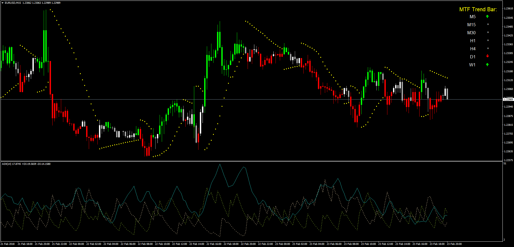

# MTF TrendBar

> Source: https://fxcodebase.com/code/viewtopic.php?f=38&t=65760  
> Forum: 38 · Topic 65760 · 1 post(s)

---

## MTF TrendBar

**Apprentice** · Sat Feb 24, 2018 6:15 am

LUA Original: [viewtopic.php?f=17&t=4150](https://fxcodebase.com/code/viewtopic.php?f=17&t=4150)

Description:

This is the MT4 version of the LUA Original indicator showing bars in trend according to the following conditions:

Up Trend
DIP > DIM and SAR < CLOSE then
Down Trend
DIP < DIM and SAR > CLOSE then
else
Neutral

It also shows a dashboard with the different currency pair's time frames for the current bar.

 [MTF_TrendBar.mq4](files/117892/MTF_TrendBar.mq4)
