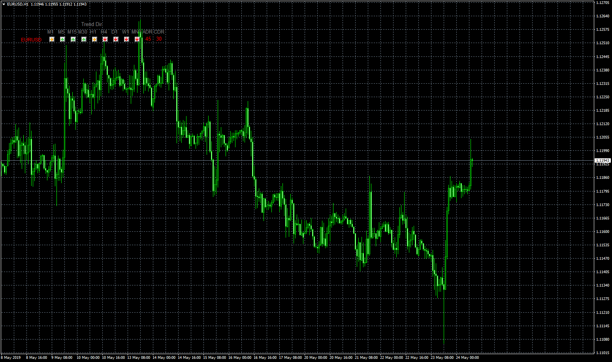

# MTF TrendDirection

> Source: https://fxcodebase.com/code/viewtopic.php?f=38&t=68502  
> Forum: 38 · Topic 68502 · 8 post(s)

---

## MTF TrendDirection

**Apprentice** · Fri May 24, 2019 4:05 am

Based on request.
[viewtopic.php?f=27&t=68475](https://fxcodebase.com/code/viewtopic.php?f=27&t=68475)

 [MTF TrendDirection.mq4](files/126517/MTF%20TrendDirection.mq4)

---

## Re: MTF TrendDirection

**TheGMan** · Fri May 24, 2019 11:06 am

Hi Apprentice

It looks like a lot of work went into making the change of my indicator & it, of course, is greatly appreciated, however....

As in my description of the change that I was looking for was to make the **Pair Names**clickable so that when a pair name would be clicked on it would then open that pair in a whole new chart on the platform.

I see that you have made the (Time Frames/Arrows) clickable not the Pair Names & it will then change the pair on the actual chart that the indicator is on.

Is it possible to make it so that just the Pair Names are clickable & that when one is clicked on it will then just open a whole new chart of that pair on the platform?

Thank you very much!
G

---

## Re: MTF TrendDirection

**Apprentice** · Thu May 30, 2019 3:50 am

Try it now.

---

## Re: MTF TrendDirection

**TheGMan** · Thu May 30, 2019 6:19 am

> **Apprentice wrote:**
> Try it now.

Wow!!! You did it!

This is absolutely fantastic! It is exactly what I was looking for it to do.

Thank you so much Apprentice & all the coders you are brilliant!

G

---

## Re: MTF TrendDirection

**trader77** · Mon Jul 24, 2023 5:17 am

can you make it work with gold and usa500

---

## Re: MTF TrendDirection

**trader77** · Mon Jul 24, 2023 5:18 am

can you make it work with gold?

---

## Re: MTF TrendDirection

**Apprentice** · Tue Jul 25, 2023 5:20 am

We have added your request to the development list.
Development reference 638.

---

## Re: MTF TrendDirection

**Apprentice** · Wed Aug 23, 2023 2:23 am

Try it now.
