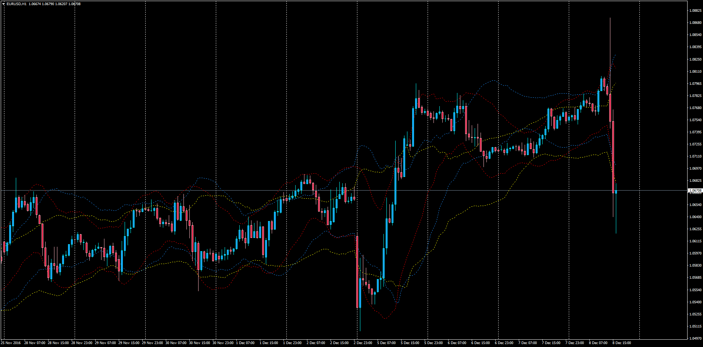

# Multi ATR Bands

> Source: https://fxcodebase.com/code/viewtopic.php?f=38&t=64190  
> Forum: 38 · Topic 64190 · 1 post(s)

---

## Multi ATR Bands

**Apprentice** · Thu Dec 08, 2016 4:19 pm

Multi ATR Bands

LUA Original: [viewtopic.php?f=17&t=2575](https://fxcodebase.com/code/viewtopic.php?f=17&t=2575)

Description:

Each set of bands take the value of the ATR, below and above the moving average:

Up= MA + ATR * Multiplier
Down= MA + ATR * Multiplier

In this indicator the trader will have the option to select up to 3 set of bands at the same time with a wide variety of moving averages. An ideal tool to add to the envelopes/bands set of indicators when trading extremes.

 [Multi_ATR_Bands.mq4](files/109638/Multi_ATR_Bands.mq4)
