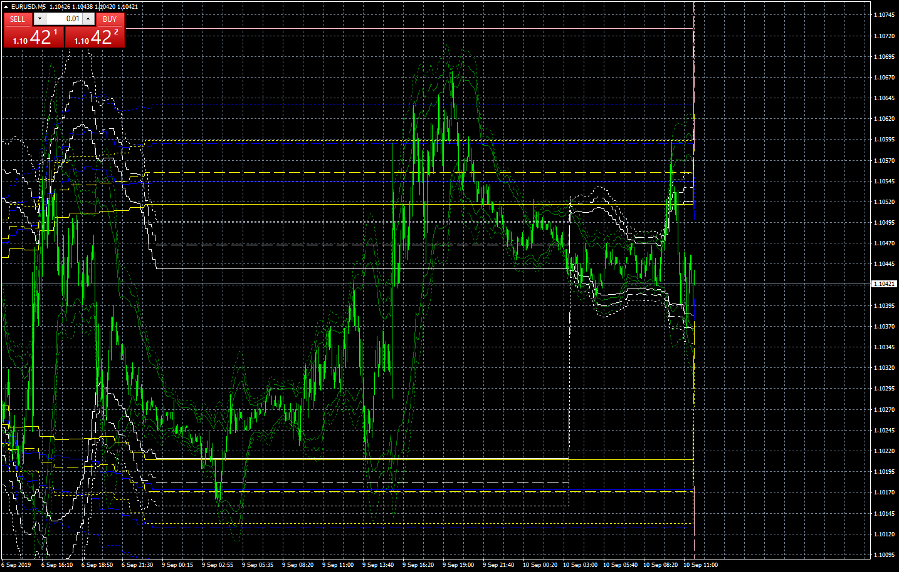

# Multi_bb

> Source: https://fxcodebase.com/code/viewtopic.php?f=38&t=68900  
> Forum: 38 · Topic 68900 · 4 post(s)

---

## Multi_bb

**Apprentice** · Tue Sep 10, 2019 5:39 am

Based on request.
[viewtopic.php?f=27&t=68889](https://fxcodebase.com/code/viewtopic.php?f=27&t=68889)

 [Multi_bb.mq4](files/128517/Multi_bb.mq4)

 [Multi_bb_dashboard.mq4](files/128517/Multi_bb_dashboard.mq4)

---

## Re: Multi_bb

**jelogui83** · Wed Sep 11, 2019 11:44 am

Hello Apprentice,

the multi bb works very well (thank you very much for this) but not the dashboard because nothing happens in the price zone, only in a down part as an indicator (rsi, macd, etc ...).
no arrow, no signal.
could we get something like this inside the price zone, ex upper left, showing signal on every time frames, for list of symbols we could select ?

thank you again.

---

## Re: Multi_bb

**Apprentice** · Thu Sep 12, 2019 8:11 am

Your request is added to the development list.
Development reference 4870 .

---

## Re: Multi_bb

**Apprentice** · Fri Sep 13, 2019 4:28 am

We can do it only for higher timeframes and for single instrument only.
