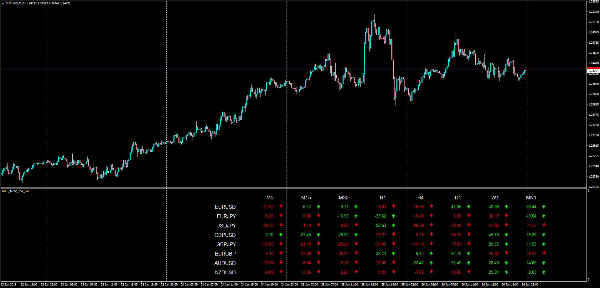
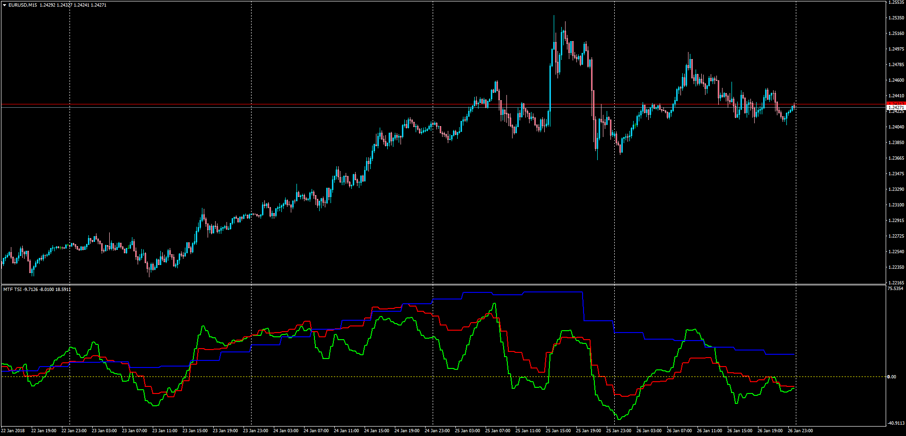

# Multi Currency Pair Multi Time Frame TSI List

> Source: https://fxcodebase.com/code/viewtopic.php?f=38&t=65679  
> Forum: 38 · Topic 65679 · 2 post(s)

---

## Multi Currency Pair Multi Time Frame TSI List

**Apprentice** · Sun Jan 28, 2018 8:54 am

LUA Original: [viewtopic.php?f=17&t=3430](https://fxcodebase.com/code/viewtopic.php?f=17&t=3430)

Description:

In this MT4 version of the LUA original, it is presented a dashboard that allows to monitor the current value of the TSI for multiple currency pairs and multiple time frames. The TSI value color indicates whether the TSI is above or below the zero line while the arrows indicate the slope.

Note: it is required to have the TSI.mq4 installed on the same indicators folder, which can be found here: [viewtopic.php?f=38&t=64665](https://fxcodebase.com/code/viewtopic.php?f=38&t=64665)

 [MTF_MCP_TSI_List.mq4](files/117315/MTF_MCP_TSI_List.mq4)

---

## Multi Time Frame TSI

**Apprentice** · Sun Jan 28, 2018 8:57 am

LUA Original: [viewtopic.php?f=17&t=3430](https://fxcodebase.com/code/viewtopic.php?f=17&t=3430)

Description:

This MT4 version of the LUA original allows to display the TSI for 3 Higher Time Frames at once.

Note: it is required to have the TSI.mq4 installed on the same indicators folder, which can be found here: [viewtopic.php?f=38&t=64665](https://fxcodebase.com/code/viewtopic.php?f=38&t=64665)

 [MTF_TSI.mq4](files/117316/MTF_TSI.mq4)
