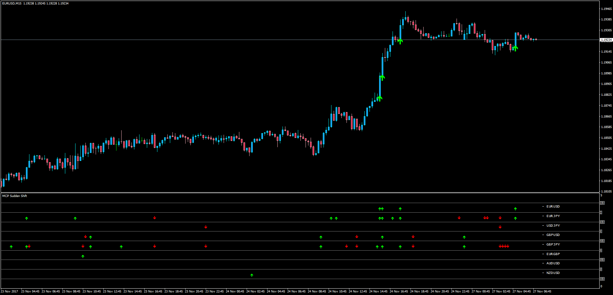

# Multi Currency Pair Sudden Shift with Alert

> Source: https://fxcodebase.com/code/viewtopic.php?f=38&t=65406  
> Forum: 38 · Topic 65406 · 1 post(s)

---

## Multi Currency Pair Sudden Shift with Alert

**Apprentice** · Tue Nov 28, 2017 6:06 am

LUA Original: [viewtopic.php?f=17&t=63620](https://fxcodebase.com/code/viewtopic.php?f=17&t=63620)

Description:

In whichever currency pair a sudden move of n number of pips is happening, this MT4 version of the LUA original indicator will alert in an MCP Dashboard about it occurrence both in a historical view and also with a sound/email alert in the current bar.

The single chart version is also included here if the trader is only interested in analyzing the sudden shifts happening in the current chart.

 [MCP_Sudden_Shift_with_Alert.mq4](files/116264/MCP_Sudden_Shift_with_Alert.mq4)

 [MTF MCP Heat Map with Alert Template.lua](files/116264/MTF%20MCP%20Heat%20Map%20with%20Alert%20Template.lua)
