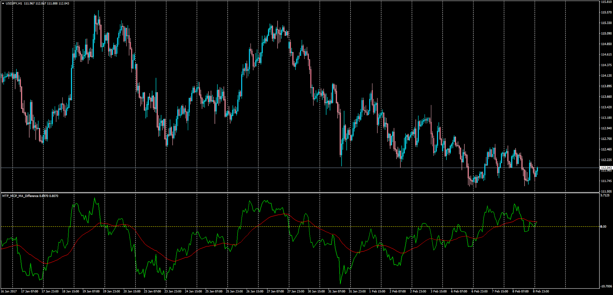

# Multi TF Multi CP Moving Average Difference

> Source: https://fxcodebase.com/code/viewtopic.php?f=38&t=64427  
> Forum: 38 · Topic 64427 · 1 post(s)

---

## Multi TF Multi CP Moving Average Difference

**Apprentice** · Thu Feb 09, 2017 12:50 pm

LUA Original:
[viewtopic.php?f=17&t=2925](https://fxcodebase.com/code/viewtopic.php?f=17&t=2925)

Description:
This is a very interesting Moving Averages study. The indicator not only takes the difference between two indicators but for each of them the trader can select:

- The Currency Pair
- The Time Frame
- The MA Method (17 in total)
- The MA Period
- The Type of Price (OHLC, median, typical and weighted)

Additionaly a Signal stream is added with the array of that difference.

However while developing the indicator one thing was clear. The difference between two instruments values has no grounds in terms of normalization since they have not been homologized.

So in order to overcome this problem a new feature has been added in this MT4 version (Normalize_Pips) which function is to take the number of pips from the current bar and the previous one depending on the TF and CP and this time indeed take the difference between one MA and the other, giving a reliable sense of comparison, and always keeping the flexibility of MTF and MCP. The result is having an oscillator with number of pips either negative or positive.

Notes: Sometimes the indicator will not produce the desired behavior if the history records are missing, so it is something to keep in mind. Working with TF of 60 mins and below and calling H4 bars as maximum can produce better results than trying to work with Daily bars, etc.

The trader can compare anything they want but it is recommended to compare either one CP's different TF's or different CP's and same TF.

In the example is showing the USD/JPY H1 vs the EUR/USD H4, both using EMA 50 periods and the Signal EMA 20 periods.

 [MTF_MCP_MA_Difference.mq4](files/110972/MTF_MCP_MA_Difference.mq4)
