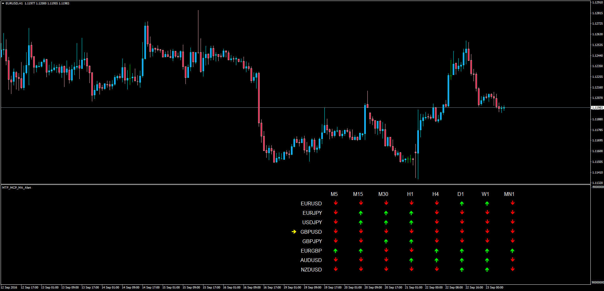

# Multi Time Frame and Multi Currency Pair Moving Average

> Source: https://fxcodebase.com/code/viewtopic.php?f=38&t=63890  
> Forum: 38 · Topic 63890 · 1 post(s)

---

## Multi Time Frame and Multi Currency Pair Moving Average

**Apprentice** · Fri Sep 23, 2016 3:06 am

LUA Original: [viewtopic.php?f=17&t=63853](https://fxcodebase.com/code/viewtopic.php?f=17&t=63853)

Description:

This indicator will analyze the current price according to the specified Moving Average (Custom Methods) and specified number of periods for the selected Time Frames of each of the pairs that want to be assessed.

Price > MA means Up
Price < MA means Down

If the "Up" or "Down" condition is met on all TFs for that pair an Alert will Pop Up and a mark will be placed next to the pair in question.

Custom: Moving Average, Applied Price, Periods, Alert Options, Pairs, Time Frames, and Colors.

 [MTF_MCP_MA_Alert.mq4](files/108235/MTF_MCP_MA_Alert.mq4)
