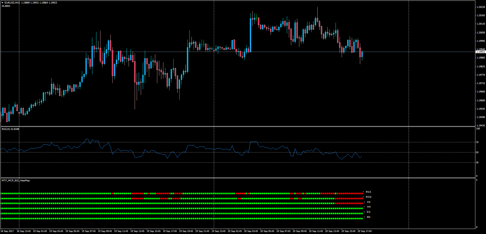

# Multi Time Frame MCP RSI HeatMap

> Source: https://fxcodebase.com/code/viewtopic.php?f=38&t=65105  
> Forum: 38 · Topic 65105 · 1 post(s)

---

## Multi Time Frame MCP RSI HeatMap

**Apprentice** · Thu Sep 21, 2017 4:12 am

LUA Original: [viewtopic.php?f=17&t=60277](https://fxcodebase.com/code/viewtopic.php?f=17&t=60277)

Description:

This dashboard is the MT4 version of the LUA Original MTF RSI Heatmap displaying the status of the RSI in higher TF's according to three different posibilities: Slope, Center Line or OB/OS Levels.

 [MTF_MCP_RSI_HeatMap.mq4](files/115022/MTF_MCP_RSI_HeatMap.mq4)
