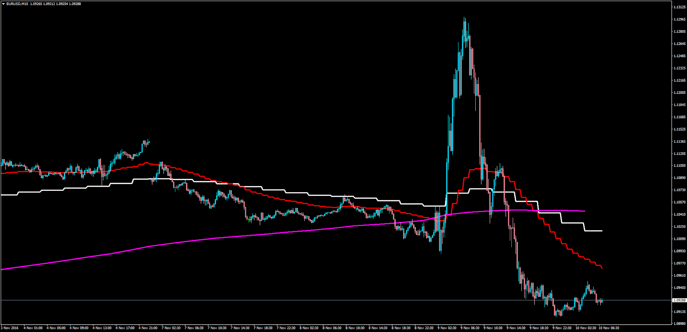
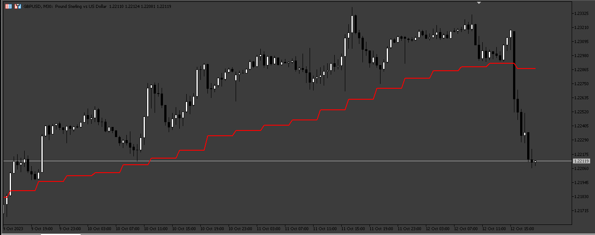

# Multi Time Frame Moving Averages

> Source: https://fxcodebase.com/code/viewtopic.php?f=38&t=64158  
> Forum: 38 · Topic 64158 · 8 post(s)

---

## Multi Time Frame Moving Averages

**Apprentice** · Thu Dec 01, 2016 10:47 am

Lua Version
[viewtopic.php?f=17&t=2287&hilit=Multi+Time+Frame+Moving+Average](https://fxcodebase.com/code/viewtopic.php?f=17&t=2287&hilit=Multi+Time+Frame+Moving+Average)

Description:

The indicator displays chosen moving average of chosen price of chosen (bigger) time frame. It also let the trader choose whether to display the MVA in steps mode or smooth line mode.

In the image example the H4 9-Periods SMMA (White) has been drawn using the Steps mode (classic MTF concept), the H1 24-Periods EMA (Red) also using Steps, and the H4 50-Periods SMA (Magenta) without steps but connection each H4 segment.

 [MTF_MA.mq4](files/109361/MTF_MA.mq4)

 [MTF_MA.mq5](files/109361/MTF_MA.mq5)

---

## Re: Multi Time Frame Moving Averages

**Kinslay** · Fri Sep 22, 2023 3:14 am

Hello Apprentice,

It's possible to have the same indicator for mt5 platform?

Regards

---

## Re: Multi Time Frame Moving Averages

**Apprentice** · Mon Sep 25, 2023 3:01 am

We have added your request to the development list.
Development reference 871.

---

## Re: Multi Time Frame Moving Averages

**Kinslay** · Fri Sep 29, 2023 8:25 am

Hello Apprentice,

Any news for the request?

Regards

---

## Re: Multi Time Frame Moving Averages

**Apprentice** · Mon Oct 02, 2023 3:03 pm

MTF_MA.mq5 added.

---

## Re: Multi Time Frame Moving Averages

**Kinslay** · Tue Oct 10, 2023 8:34 am

Hello Apprentice,

Unfortunately, there are some bugs regarding the MT5 indicator.
Specifically, in the first screenshot I set a 20-period h4 average, and as you can see the average does not follow the price correctly.

In the second screenshot I switched the chart to h1 and again the h4 timeframe average is not showing to h1 chart.

Can you fix this?

---

## Re: Multi Time Frame Moving Averages

**Apprentice** · Thu Oct 12, 2023 3:34 am

We have added your request to the development list.
Development reference 912

---

## Re: Multi Time Frame Moving Averages

**Apprentice** · Fri Oct 13, 2023 3:18 am

 [MTF_MA.mq5](files/152913/MTF_MA.mq5)
