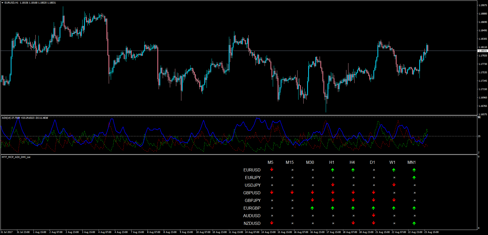
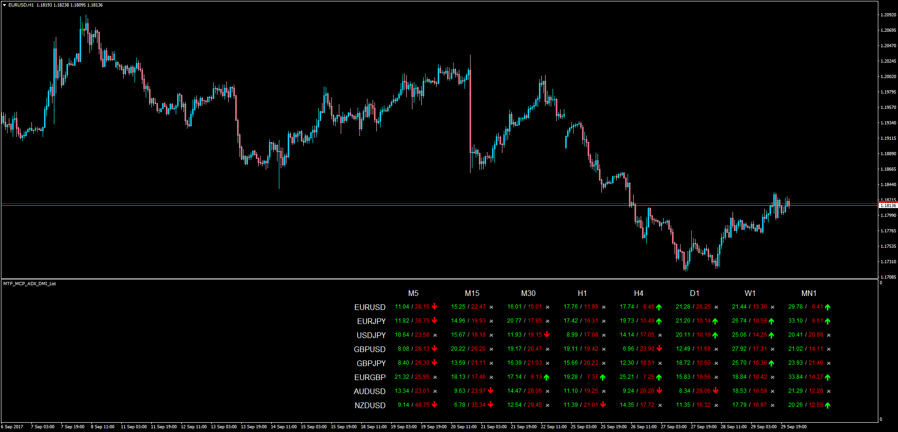
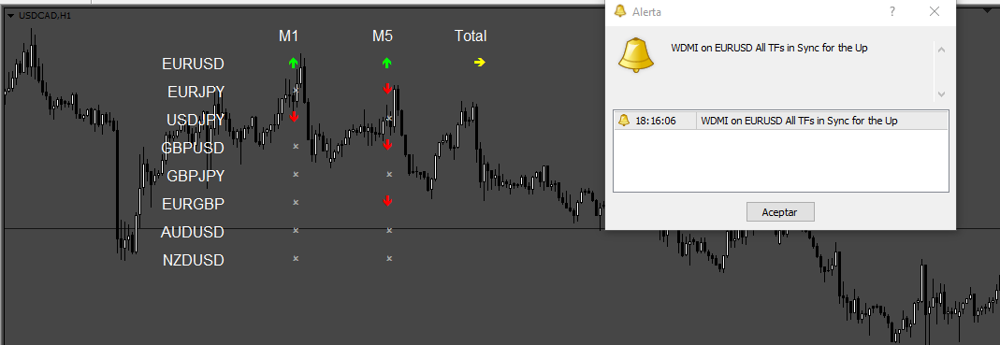
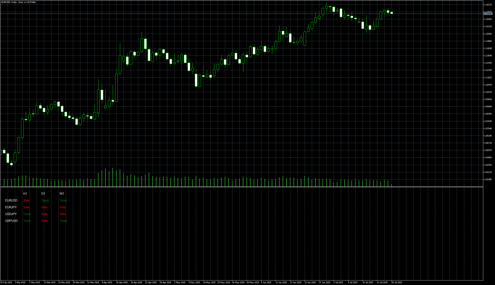

# Multi Time Frame Multi Currency Pair ADX/DMI List

> Source: https://fxcodebase.com/code/viewtopic.php?f=38&t=65018  
> Forum: 38 · Topic 65018 · 18 post(s)

---

## Multi Time Frame Multi Currency Pair ADX/DMI List

**Apprentice** · Thu Aug 24, 2017 6:12 am

LUA Original: [viewtopic.php?f=17&t=60275](https://fxcodebase.com/code/viewtopic.php?f=17&t=60275)

Description:

This Dashboard is based on the LUA Original which calculations go as follows:

1. UP GREEN ARROW

Adx> ADX level
Adx (period)>Adx(period-1)
Dmi Positive > Dmi Negative

2. RED DOWN ARROW

Adx> ADX level
Adx (period)>Adx(period-1)
Dmi Positive < Dmi Negative

3. Otherwise Draw Grey DOT

 [MTF_MCP_ADX_DMI_List.mq4](files/114380/MTF_MCP_ADX_DMI_List.mq4)

---

## Re: Multi Time Frame Multi Currency Pair ADX/DMI List

**Apprentice** · Tue Oct 03, 2017 4:07 am

LUA Original: [viewtopic.php?f=17&t=5190](https://fxcodebase.com/code/viewtopic.php?f=17&t=5190)

Description:

This MT4 version of the LUA Original is also an addition to the indicator already presented here: [viewtopic.php?f=17&t=60275](https://fxcodebase.com/code/viewtopic.php?f=17&t=60275)

The rules for the arrows are as follow:

- Up Green Arrow: Current ADX > ADX Defined Level; Current ADX > Previous ADX; DMIplus > DMIminus
- Up Red Arrow: Current ADX > ADX Defined Level; Current ADX > Previous ADX; DMIplus < DMIminus

So in this version, the DMI Plus and DMI Minus values were added making it easier to asses what is actually happen on each pair and time frame.

 [MTF_MCP_ADX_DMI_List.mq4](files/115228/MTF_MCP_ADX_DMI_List.mq4)

---

## Re: Multi Time Frame Multi Currency Pair ADX/DMI List

**nookie** · Sun Feb 04, 2018 7:30 am

Is it possible this indicator to be based on Wilders dmi instead of the mt4 adx ?

---

## Re: Multi Time Frame Multi Currency Pair ADX/DMI List

**Apprentice** · Mon Feb 05, 2018 5:09 pm

Your request is added to the development list under Id Number 4038

---

## Re: Multi Time Frame Multi Currency Pair ADX/DMI List

**Apprentice** · Fri Feb 09, 2018 6:55 am

[MTF_MCP_WDMI_List.mq4](files/117668/MTF_MCP_WDMI_List.mq4)

 [MTF_MCP_WDMI_List_values.mq4](files/117668/MTF_MCP_WDMI_List_values.mq4)

Wilders DMI version
Wilders DMI is available here.
[viewtopic.php?f=38&t=65625&hilit=Wilders+dmi](https://fxcodebase.com/code/viewtopic.php?f=38&t=65625&hilit=Wilders+dmi)

---

## Re: Multi Time Frame Multi Currency Pair ADX/DMI List

**jusiur** · Wed May 09, 2018 8:21 pm

Hi Apprentice
thank you for these useful tools, as far as I know and I have searched, it´s the only one of its kind.
Could I please ask, if it is possible the same indicator that give signal in closed candle (not current (0) but last (1)).
I would greatly appreciate your time and interest.

---

## Re: Multi Time Frame Multi Currency Pair ADX/DMI List

**Apprentice** · Thu May 10, 2018 5:35 am

Your request is added to the development list under Id Number 4137

---

## Re: Multi Time Frame Multi Currency Pair ADX/DMI List

**nookie** · Wed May 30, 2018 3:07 pm

MTF_MCP_WDMI_List.mq4
 (15.32 KiB)

 MTF_MCP_WDMI_List_values.mq4
 (15.84 KiB)

Is it possible those indicators to be able to be displayed in the main window rather than a new indicator window ?

---

## Re: Multi Time Frame Multi Currency Pair ADX/DMI List

**Apprentice** · Thu May 31, 2018 9:04 am

Your request is added to the development list under Id Number 4156

---

## Re: Multi Time Frame Multi Currency Pair ADX/DMI List

**Apprentice** · Wed Jun 06, 2018 10:41 am

[MTF_MCP_ADX_DMI_Filter.mq4](files/119493/MTF_MCP_ADX_DMI_Filter.mq4)

 [MTF_MCP_ADX_DMI_List.mq4](files/119493/MTF_MCP_ADX_DMI_List.mq4)

Try this versions.

The user will need these parameters:
Alert_Confirmed_In_Line_Signals
Alert_Unconfirmed_In_Line_Signals

---

## Re: Multi Time Frame Multi Currency Pair ADX/DMI List

**nookie** · Fri Jun 08, 2018 2:54 pm

It is not showing in the main window. When I drag and drop it is still not showing in the main area. Seems like a bug or not sure, this is for the both indicators.

---

## Re: Multi Time Frame Multi Currency Pair ADX/DMI List

**Apprentice** · Mon Jun 18, 2018 6:42 am

[MTF_MCP_WDMI_List_MC.mq4](files/119607/MTF_MCP_WDMI_List_MC.mq4)

 [MTF_MCP_WDMI_List_values_MC.mq4](files/119607/MTF_MCP_WDMI_List_values_MC.mq4)

Try this version.

---

## Re: Multi Time Frame Multi Currency Pair ADX/DMI List

**Teruyoshi** · Tue May 28, 2024 6:27 am

Dear, Apprentice.
I have a few requests on MTF_MCP_WDMI_List_MC.mq4.
I think this is in itself awesome indicator but nees to be modified a little.
" Total Signals" remain unchanged when ADX slope changes.
Also, as for alert, it would be much better for not only me but also other traders to be notified which pair's adx changes its angle.
Could you fix theses two functions?

---

## Re: Multi Time Frame Multi Currency Pair ADX/DMI List

**Apprentice** · Sun Jun 02, 2024 2:52 pm

We have added your request to the development list.
Development reference 467

---

## Re: Multi Time Frame Multi Currency Pair ADX/DMI List

**Apprentice** · Fri Jul 05, 2024 5:36 am

 [MTF_MCP_WDMI_List_MC.mq4](files/156018/MTF_MCP_WDMI_List_MC.mq4)

---

## Re: Multi Time Frame Multi Currency Pair ADX/DMI List

**Frank8093** · Fri Aug 09, 2024 4:50 am

Dear Sir

Can you add MT5 File.
Regards

---

## Re: Multi Time Frame Multi Currency Pair ADX/DMI List

**Apprentice** · Sat Aug 10, 2024 6:59 pm

We have added your request to the development list.
Development reference 642

---

## Re: Multi Time Frame Multi Currency Pair ADX/DMI List

**Apprentice** · Fri Jul 25, 2025 4:14 am

 [ADXW.mq5](files/160021/ADXW.mq5)

 [ADXW_Dashboard.mq5](files/160021/ADXW_Dashboard.mq5)
