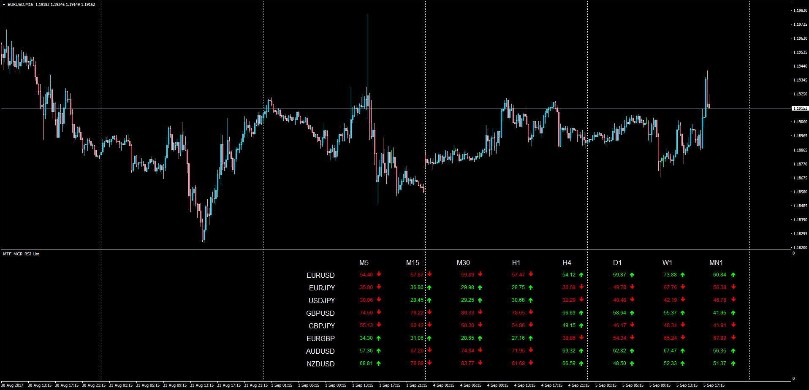

# Multi Time Frame Multi Currency Pair RSI List

> Source: https://fxcodebase.com/code/viewtopic.php?f=38&t=65057  
> Forum: 38 · Topic 65057 · 4 post(s)

---

## Multi Time Frame Multi Currency Pair RSI List

**Apprentice** · Tue Sep 05, 2017 2:27 pm

LUA Original: [viewtopic.php?f=17&t=32319](https://fxcodebase.com/code/viewtopic.php?f=17&t=32319)

Description:

This is the MT4 version of the LUA original dashboard displaying the RSI values of the selected Currency Pairs for all the time frames available. It also shows the color variation happening between the current and previous period of each time frame.

 [MTF_MCP_RSI_List.mq4](files/114712/MTF_MCP_RSI_List.mq4)

---

## Re: Multi Time Frame Multi Currency Pair RSI List

**maclaud** · Tue Sep 04, 2018 6:27 am

Hi, thanks a lot for this useful board. If possible a slight change in view of the choice of the closing price would be awesome

---

## Re: Multi Time Frame Multi Currency Pair RSI List

**Apprentice** · Wed Sep 05, 2018 4:13 am

Your request is added to the development list under Id Number 4251

---

## Re: Multi Time Frame Multi Currency Pair RSI List

**Apprentice** · Wed Sep 12, 2018 7:41 am

Try it now.
