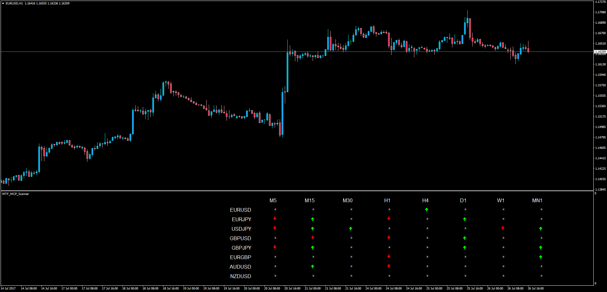

# Multi Time Frame Multi Currency Pair Scanner

> Source: https://fxcodebase.com/code/viewtopic.php?f=38&t=64951  
> Forum: 38 · Topic 64951 · 9 post(s)

---

## Multi Time Frame Multi Currency Pair Scanner

**Apprentice** · Thu Jul 27, 2017 9:03 am

LUA Original: [viewtopic.php?f=17&t=59736](https://fxcodebase.com/code/viewtopic.php?f=17&t=59736)

Description:

This is the MT4 version of the LUA Original "MTF MCP Scanner" to assess which pair is better to trade in either direction. Time Frames and Currency Pairs are customizable.

INDICATORS:

1. DMI WITH DEFAULT PARAMETERS

2.STOCHASTIC WITH DEFAULT PARAMETERS

OVER BOUGHT LEVEL: 80
OVER SOLD LEVEL: 20

3.STOCH RSI WITH DEFAULT PARAMETERS

OVER BOUGHT LEVEL :90
OVER SOLD LEVEL:10

4.WILLAMS PERCENTAGE(RLW%)

OVER BOUGHT LEVEL :-20%
OVER SOLD LEVEL:-80%

TIME FRAMES: D1,W1,M1

GREEN DOT:
DMI POSITIVE> DMI NEGATIVE AND
STOCH K>D AND D< OVER BOUGHT LEVEL AND
STOCHRSI D--LINE< OVERBOUGHT LEVEL AND
RLW%< OVERBOUGHT LEVEL

RED DOT:

DMI NEGATIVE > DMI POSITIVE
STOCH K< D AND D >OVER SOLD LEVEL
STOCHRSI D- LINE > OVER SOLD LEVEL
RLW%> OVER SOLD LEVEL

 [MTF_MCP_Scanner.mq4](files/113775/MTF_MCP_Scanner.mq4)

Note: Stochastic_RSI_MTF_basic.mq4 indicator required to be installed within the same folder in Indicators.

 [Stochastic_RSI_MTF_basic.mq4](files/113775/Stochastic_RSI_MTF_basic.mq4)

---

## Re: Multi Time Frame Multi Currency Pair Scanner

**durlovjagiroad** · Tue Mar 31, 2020 4:02 pm

Update this scanner for latest mt4 and add TVI and Twiggs money flow in the indicator option. Thanks

---

## Re: Multi Time Frame Multi Currency Pair Scanner

**Apprentice** · Wed Apr 01, 2020 6:09 am

Your request is added to the development list.
Development reference 982.

---

## Re: Multi Time Frame Multi Currency Pair Scanner

**Apprentice** · Thu Apr 02, 2020 6:33 am

[MTF_MCP_Scanner.mq4](files/132506/MTF_MCP_Scanner.mq4)

Try this version.

---

## Re: Multi Time Frame Multi Currency Pair Scanner

**durlovjagiroad** · Thu Apr 02, 2020 8:10 am

unable to load multiple symbolpair, got hanged. Moreover TVI and money flow option missing

---

## Re: Multi Time Frame Multi Currency Pair Scanner

**Apprentice** · Thu Apr 02, 2020 10:25 am

Your request is added to the development list.
Development reference 996.

---

## Re: Multi Time Frame Multi Currency Pair Scanner

**Apprentice** · Fri Apr 03, 2020 5:33 am

I need logic for TVI and money flow!
I don't have any issues. It's likely that your MT4 just waits requested data to be loaded. There is nothing we can do with it.

---

## Re: Multi Time Frame Multi Currency Pair Scanner

**durlovjagiroad** · Fri Apr 03, 2020 7:32 am

> **Apprentice wrote:**
> I need logic for TVI and money flow!
> I don't have any issues. It's likely that your MT4 just waits requested data to be loaded. There is nothing we can do with it.

When I add 10 to 20 symbols , it does not respond.

---

## Re: Multi Time Frame Multi Currency Pair Scanner

**Bigdawg_trader** · Sat Aug 08, 2020 6:15 am

> **durlovjagiroad wrote:**
>
>
> > **Apprentice wrote:**
> > I need logic for TVI and money flow!
> > I don't have any issues. It's likely that your MT4 just waits requested data to be loaded. There is nothing we can do with it.
>
>
>
> When I add 10 to 20 symbols , it does not respond.

Ok brother I can help you out here based on my experience... Liteforex broker has "Currency Indexes" and this should cover for the whole market. They are as follows... EURLFX,USDLFX,CHFLFX,GBPLFX,LFXJPY,CADLFX,AUDLFX,NZDLFX now your indicator actually works like magic especially in picking out early market turns. this should work out as follows for example... if you see a buy on #Eurlfx and sell in maybe #Cadlfx that is a major market turn... buy on #Eurcad and if you see Buy in for example #Gbplfx H1 and a sell on #Usdlfx m15 then observe the lower timeframe move... it comes first in this strategy that should be #Gbpusd buy on m15 TF
