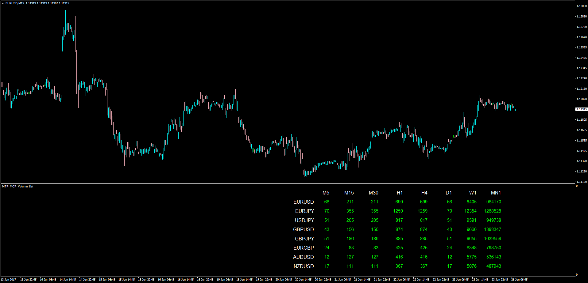

# Multi Time Frame Multi Currency Pair Volume List

> Source: https://fxcodebase.com/code/viewtopic.php?f=38&t=64845  
> Forum: 38 · Topic 64845 · 1 post(s)

---

## Multi Time Frame Multi Currency Pair Volume List

**Apprentice** · Mon Jun 26, 2017 3:26 am

LUA Original: [viewtopic.php?f=17&t=32684](https://fxcodebase.com/code/viewtopic.php?f=17&t=32684)

Description:

MT4 Version of the LUA Original: Generated list will show volume, for all selected time frames and currency pairs.

 [MTF_MCP_Volume_List.mq4](files/113153/MTF_MCP_Volume_List.mq4)
