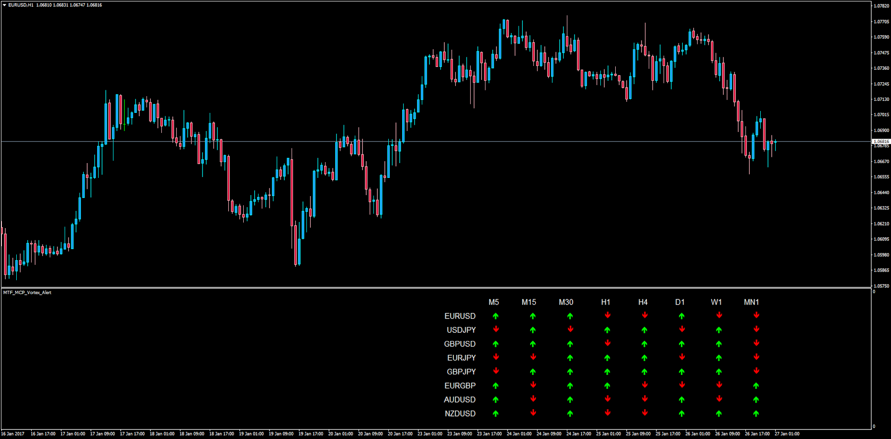

# Multi Time Frame Multi Currency Pair VORTEX with Alerts

> Source: https://fxcodebase.com/code/viewtopic.php?f=38&t=64349  
> Forum: 38 · Topic 64349 · 1 post(s)

---

## Multi Time Frame Multi Currency Pair VORTEX with Alerts

**Apprentice** · Fri Jan 27, 2017 3:07 am

LUA Original: [viewtopic.php?f=17&t=277](https://fxcodebase.com/code/viewtopic.php?f=17&t=277)

Description:

This Subwindow will record the current status of each VORTEX in every time frame and currency pair analyzed. If there is a full coincidence on any pair an alert will pop up indicating such case.

Green arrow shows when VM+ line is above the center line (100) and Red when the VM- is above, which would be similar to the DM+ and DM- behavior.

 [MTF_MCP_Vortex_Alert.mq4](files/110731/MTF_MCP_Vortex_Alert.mq4)
