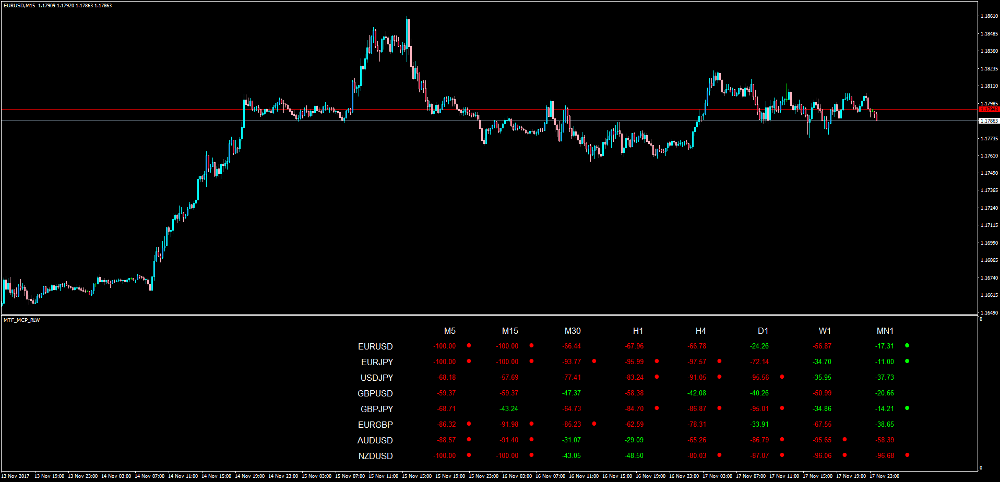

# Multi Time Frame Multi Currency Pair Williams Percent Range

> Source: https://fxcodebase.com/code/viewtopic.php?f=38&t=65376  
> Forum: 38 · Topic 65376 · 1 post(s)

---

## Multi Time Frame Multi Currency Pair Williams Percent Range

**Apprentice** · Sun Nov 19, 2017 4:08 pm

LUA Original: [viewtopic.php?f=17&t=61353](https://fxcodebase.com/code/viewtopic.php?f=17&t=61353)

Description:

In this MT4 version of the LUA original MTF MCP RLW, the user can decide whether to analyze if the RLW is above a particular buy level (-50 by default) or below a sell level (-50 by default), or if simply is higher or lower than the previous williams percent value. This is done by choosing the WPR_Buy_Sell_Level true or false. As a result the WPR value's color is green or red.

In addition, if the WPR in a particular currency pair and time frame is above the OB level or below the OS level, a colored dot will be placed next to the WPR value.

 [MTF_MCP_RLW.mq4](files/116108/MTF_MCP_RLW.mq4)
