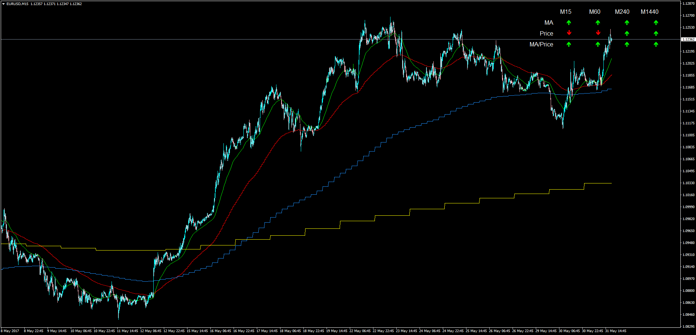

# Multi_Time_Frame_Overview

> Source: https://fxcodebase.com/code/viewtopic.php?f=38&t=64697  
> Forum: 38 · Topic 64697 · 8 post(s)

---

## Multi_Time_Frame_Overview

**Apprentice** · Wed May 31, 2017 3:04 pm

LUA Original: [viewtopic.php?f=17&t=2717](https://fxcodebase.com/code/viewtopic.php?f=17&t=2717)

Description:

This is the MT4 version of the LUA original indicator that displays up to 4 different Time Frame Moving Averages in one chart and does an analysis of the current bar of each Timeframe:

- MA Slope
- Price increasing/decreasing
- Price Above/Below MA

Alert: If all slopes and position are in sync within all the different TF's the indicator will provide an alert.

 [Multi_Time_Frame_Overview.mq4](files/112644/Multi_Time_Frame_Overview.mq4)

---

## Re: Multi_Time_Frame_Overview

**logicgate** · Thu Jan 03, 2019 8:54 am

Thanks!

Can you add the VWMA and the Smoothed version (and the exponential version if you end up coding it) to the pool of MAs of this indi?

---

## Re: Multi_Time_Frame_Overview

**Apprentice** · Thu Jan 03, 2019 10:05 am

Your request is added to the development list under Id Number 4399

---

## Re: Multi_Time_Frame_Overview

**Alexander.Gettinger** · Thu Jan 03, 2019 5:38 pm

VWMA added:

 [Multi_Time_Frame_Overview.mq4](files/123169/Multi_Time_Frame_Overview.mq4)

---

## Re: Multi_Time_Frame_Overview

**logicgate** · Thu Jan 03, 2019 8:22 pm

> **Alexander.Gettinger wrote:**
> VWMA added:
>
>
> Multi_Time_Frame_Overview.mq4

Thanks so much!

---

## Re: Multi_Time_Frame_Overview

**logicgate** · Sun Jan 06, 2019 7:25 am

Can you add the smoothed version too? From here:

[viewtopic.php?f=38&t=67144](https://fxcodebase.com/code/viewtopic.php?f=38&t=67144)

---

## Re: Multi_Time_Frame_Overview

**Apprentice** · Sun Jan 06, 2019 12:29 pm

Your request is added to the development list under Id Number 4410

---

## Re: Multi_Time_Frame_Overview

**Apprentice** · Wed Jan 09, 2019 7:31 am

[Smoothed_Multi_Time_Frame_Overview.mq4](files/123278/Smoothed_Multi_Time_Frame_Overview.mq4)
