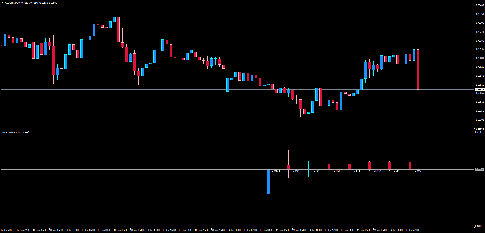

# Multi Time Frame Price Bar

> Source: https://fxcodebase.com/code/viewtopic.php?f=38&t=65655  
> Forum: 38 · Topic 65655 · 13 post(s)

---

## Multi Time Frame Price Bar

**Apprentice** · Sun Jan 21, 2018 6:28 am

LUA Original: [viewtopic.php?f=17&t=3021](https://fxcodebase.com/code/viewtopic.php?f=17&t=3021)

Description:

MT4 version of the original LUA indicator showing the last candle of the different time frames of the current currency pair.

 [MTF_Price_Bar.mq4](files/117164/MTF_Price_Bar.mq4)

 [MTF_Heikin_ashi_bar.mq4](files/117164/MTF_Heikin_ashi_bar.mq4)

---

## Re: Multi Time Frame Price Bar

**seunboi4u** · Sun Apr 29, 2018 10:47 am

yes i love the indicator but i later get the indicator at forex factory but you can also make your unique......see the picture below thanks so much

---

## Re: Multi Time Frame Price Bar

**Apprentice** · Mon Apr 30, 2018 4:02 pm

You want to display several time frames on a single chart?

---

## Re: Multi Time Frame Price Bar

**nookie** · Wed May 30, 2018 4:37 pm

Indicator is great, can visualization be improved a bit?

choice of where to be shown in the main chart window.. top right, top left.
view of the various candle timeframe looks not well proportioned, one huge candle is there and lesser timeframes are almost invisible, if this can be improved will be great

---

## Re: Multi Time Frame Price Bar

**nookie** · Wed May 30, 2018 4:48 pm

Also, one more thing would be much appreciated:

Next bar in Min; seconds for each MTF candle if its possible

---

## Re: Multi Time Frame Price Bar

**Apprentice** · Thu May 31, 2018 9:05 am

Your request is added to the development list under Id Number 4157

---

## Re: Multi Time Frame Price Bar

**nookie** · Thu May 31, 2018 11:03 am

I am using this indicator for 1 day and on a 8 core CPU it almost hangs using it on 2 charts, is it a bug or this is normal ? MT4 crashes from time to time when this is used after 1 hour..

---

## Re: Multi Time Frame Price Bar

**nookie** · Fri Jun 08, 2018 2:57 pm

It is not refreshing when a candle is completed, have to refresh it manually, is it possible to be auto refreshed when candle is completed ?

---

## Re: Multi Time Frame Price Bar

**nookie** · Sat Jun 09, 2018 11:49 am

Hello is it possible the price bar to be calculated as Heikin ashi bar ?

---

## Re: Multi Time Frame Price Bar

**Apprentice** · Mon Jun 11, 2018 10:51 am

MTF_Heikin_ashi_bar.mq4 added.
MTF_Price_Bar.mq4 Fixed.

---

## Re: Multi Time Frame Price Bar

**nookie** · Mon Jun 11, 2018 12:44 pm

Thanks! When I compare the Heikin ashi on chart and the ones on different timeframes of the MTF_Heikin_ashi_bar.mq4 they are not the same.

I think the representation for the MTF_Heikin_ashi_bar.mq4 is not as the Heikin ashi indicator ?

---

## Re: Multi Time Frame Price Bar

**Apprentice** · Tue Jun 12, 2018 7:44 am

Can you please test this version.

---

## Re: Multi Time Frame Price Bar

**Apprentice** · Tue Jun 12, 2018 12:33 pm

The Indicator was revised and updated.
