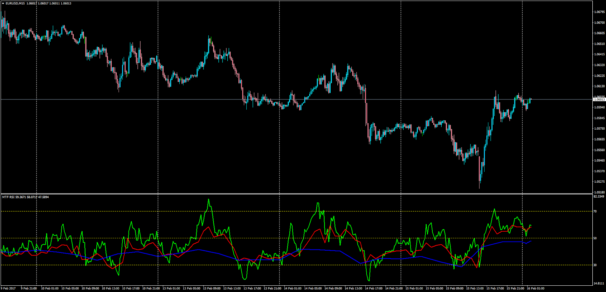

# Multi Time Frame RSI

> Source: https://fxcodebase.com/code/viewtopic.php?f=38&t=64464  
> Forum: 38 · Topic 64464 · 1 post(s)

---

## Multi Time Frame RSI

**Apprentice** · Thu Feb 16, 2017 3:27 am

LUA Original: [viewtopic.php?f=17&t=3005](https://fxcodebase.com/code/viewtopic.php?f=17&t=3005)

Description:

This is the MT4 version of the BTF RSI concept from LUA. The only difference being that instead of a dashboard (which can also be made if requested) the very Higher TF's RSI have been placed. This gives a visual representation of what is taking place on each of them and the interaction with the 30/50/70 lines.

 [MTF_RSI.mq4](files/111084/MTF_RSI.mq4)
