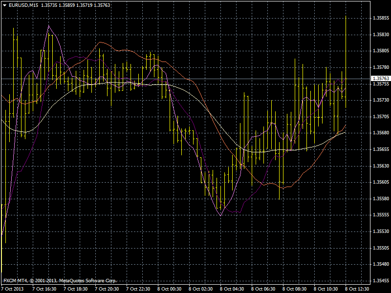

# Multi Wave Analysis (MWA)

> Source: https://fxcodebase.com/code/viewtopic.php?f=38&t=59619  
> Forum: 38 · Topic 59619 · 6 post(s)

---

## Multi Wave Analysis (MWA)

**Apprentice** · Tue Oct 08, 2013 7:45 am

Theoretical basis of the indicators I've developed in the very beginning of my work on this forum, still did not know how to write indicator.

This indicator that I suggest was never developed for any other platform.
I call it Multi Wave Analysis.

Idea that have led me in developing this indicator is to try to distinguish waves of different amplitude and period.

Simplified, moving average with a larger period is the baseline for a shorter period moving average.
Shorter period moving average, fluctuated around a longer period moving average.

Unlike moving average, which followed the closing price, WMA predict price trends, and indicate, the deviation from the defined wave.

WMA can reach a value higher than the maximum closing price for that period, the reason, the price moves below the short-wave, the moving average continue to grow, but due to changes in market conditions, momentum, inertia, or the fundamental data, price did not continue its growth.

As a basis, I suggest the ordinary 200 period MVA,
then we deduct MWA 200 from the closing price,
now we Calculate 100 period MVA of Residual,
Again, deduct MVA 100 from Residual.

Procedure must be repeated for 50, 25, 12 and 6 period.

You can use all MWA components simultaneously, one pair,
or only one component as Wave Moving Average.

Advantages of these modified moving average is obvious, at least to me,
earlier detection of changes in trend precise support and resistance definitions,

Signals
Signal is generated if MWA with Lower period Growth / Fall Above / Below Higher period WMA.

Better results would be achieved if they could determine the exact period, the cycle of each wave.

 [MWA.ex4](files/89888/MWA.ex4)

---

## Re: Multi Wave Analysis (MWA)

**greenfork** · Tue Oct 08, 2013 7:57 am

Excellent work as always.

---

## Re: Multi Wave Analysis (MWA)

**greenfork** · Wed Oct 09, 2013 4:51 pm

Hi,
I've noticed on my MT4 platform the indicator doesn't seem to update with each candle.
I have to manually go to the properties of the indicator and click OK and it will update again.
Is it possible to get this resolved.
Thanks.

---

## Re: Multi Wave Analysis (MWA)

**Apprentice** · Thu Oct 10, 2013 12:11 pm

Try Updated Version.

---

## Re: Multi Wave Analysis (MWA)

**silca20** · Mon Aug 07, 2017 11:47 am

You can publish the mq4 file?
thank you

---

## Re: Multi Wave Analysis (MWA)

**Apprentice** · Tue Aug 08, 2017 2:54 am

Unfortunately, I can not publish it publicly.
An explanation should be enough if you are trying to recreate it.
