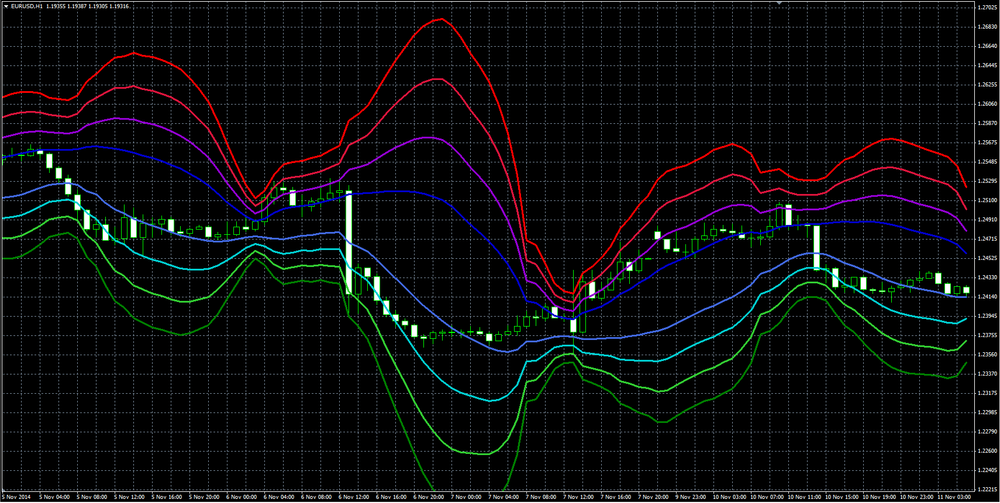

# Multiple Bollinger Bands Deviation Lines

> Source: https://fxcodebase.com/code/viewtopic.php?f=38&t=61672  
> Forum: 38 · Topic 61672 · 1 post(s)

---

## Multiple Bollinger Bands Deviation Lines

**Alexander.Gettinger** · Tue Jan 06, 2015 11:43 am

Original LUA indicator: [viewtopic.php?f=17&t=1319](https://fxcodebase.com/code/viewtopic.php?f=17&t=1319).

Formulas:
U1 = MA+d,
L1 = MA-d,
U2 = MA+2*d,
L2 = MA-2*d,
U3 = MA+3*d,
L3 = MA-3*d,
U4 = MA+4*d,
L4 = MA-4*d, where
MA - moving average with [Length] number of periods and [Method] type,
d = Deviation*StdDev,
StdDev - standard deviation.

 

Download:

 [MBBD.mq4](files/98014/MBBD.mq4)
