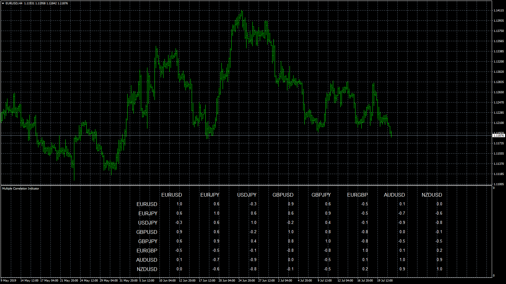

# Multiple Correlation indicator

> Source: https://fxcodebase.com/code/viewtopic.php?f=38&t=68695  
> Forum: 38 · Topic 68695 · 4 post(s)

---

## Multiple Correlation indicator

**Apprentice** · Tue Jul 23, 2019 5:21 am

 [Multiple Correlation indicator.mq4](files/127479/Multiple%20Correlation%20indicator.mq4)

---

## Re: Multiple Correlation indicator

**jusiur** · Tue Aug 06, 2019 11:17 pm

hello dear Apprentice, a special favor, is there a possibility to incorporate a function these functions?
-a function to reduce the space between columns and rows
-a function to adjust the text size
-a function to highlight if the correlation is greater or lesser for example at 90?
I am a little embarrassed to ask so many requests, but I would like to have the complete map on the same screen of all the pairs provided by the broker.
Thank you very much for the possibility of doing so.

---

## Re: Multiple Correlation indicator

**Apprentice** · Wed Aug 07, 2019 5:00 pm

Your request is added to the development list under Id Number 4829

---

## Re: Multiple Correlation indicator

**Apprentice** · Sat Aug 10, 2019 5:21 am

Try this version.

 [Multiple Correlation indicator.mq4](files/127818/Multiple%20Correlation%20indicator.mq4)
