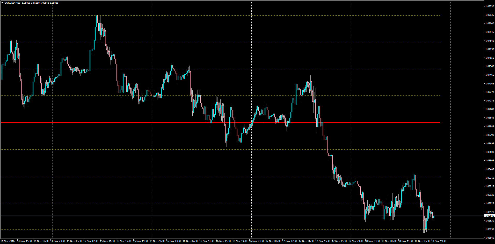

# Multiple Equidistant Lines

> Source: https://fxcodebase.com/code/viewtopic.php?f=38&t=64114  
> Forum: 38 · Topic 64114 · 1 post(s)

---

## Multiple Equidistant Lines

**Apprentice** · Fri Nov 18, 2016 3:04 pm

Description:

This indicator will plot multiple horizontal equidistant lines based on the mid point of the screen or in the price choosed by the trader separated by a determined number of pips each.

 [Multiple_Equidistant_Lines.mq4](files/109137/Multiple_Equidistant_Lines.mq4)

TS2/Marketscope version.
[viewtopic.php?f=17&t=61107&p=95733#p95733](https://fxcodebase.com/code/viewtopic.php?f=17&t=61107&p=95733#p95733)
