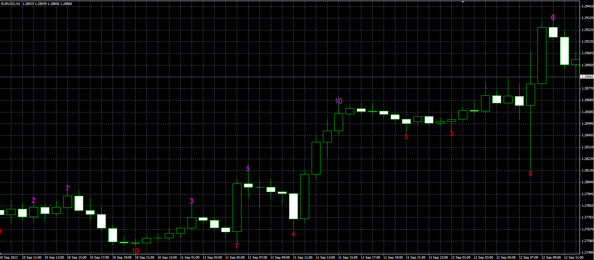

# Multiple fractals

> Source: https://fxcodebase.com/code/viewtopic.php?f=38&t=23329  
> Forum: 38 · Topic 23329 · 1 post(s)

---

## Multiple fractals

**Alexander.Gettinger** · Wed Sep 12, 2012 11:44 am

Indicator calculates the maximum fractal level and displays it on a chart.

For example level 5 for the upper fractal means that the top of the fractal more than 5 bars on the left and 5 bars on the right from the fractal.

 

Download:

 [MultipleFractals.mq4](files/40160/MultipleFractals.mq4)
