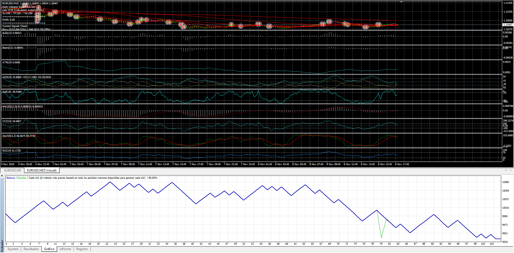
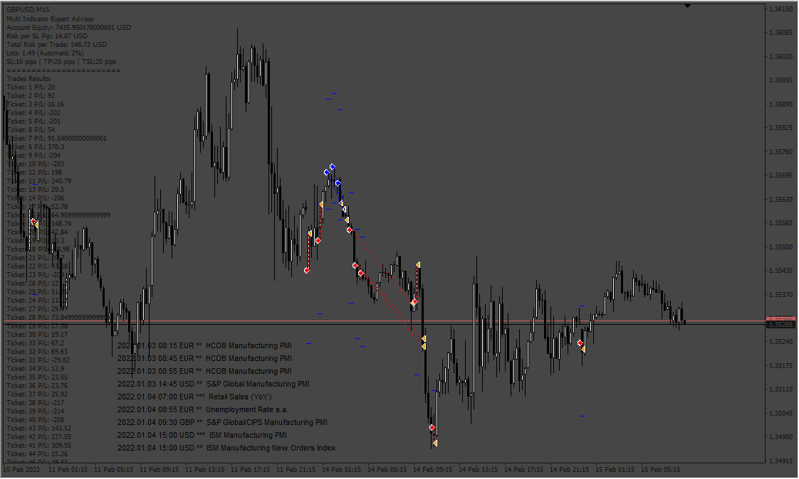
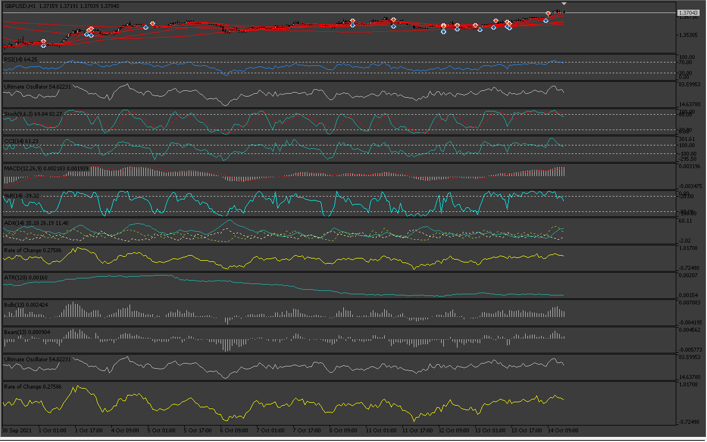

# Multiple Indicator Exper Advisor

> Source: https://fxcodebase.com/code/viewtopic.php?f=38&t=64496  
> Forum: 38 · Topic 64496 · 38 post(s)

---

## Multiple Indicator Exper Advisor

**Apprentice** · Wed Mar 01, 2017 5:28 am

DESCRIPTION:

This Expert Advisor is a complete trading system based on a variety of technical indicators, moving averages and pivots. Each of those elements can be assessed in many ways (depending on the indicator) providing limitless optimization scenarios for the expert advisor. In order to work it is needed to play with the variables and create defined rules and coefficients. Default parameters will not provide the expected positive results.

Indicators included with the possible scenarios for Entry:

- RSI (Above Middle Line, Below Middle Line, Positive Slope, Negative Slope, Above OverBought Level, Below OverSold Level)
- Stochastic (Above Middle Line, Below Middle Line, Positive Slope, Negative Slope, Above OverBought Level, Below OverSold Level)
- CCI (Above Middle Line, Below Middle Line, Positive Slope, Negative Slope, Above OverBought Level, Below OverSold Level)
- Ultimate_Oscillator (Above Middle Line, Below Middle Line, Positive Slope, Negative Slope, Above OverBought Level, Below OverSold Level)
- MACD (Above Middle Line, Below Middle Line, Positive Slope, Negative Slope)
- Williams_Percent (Above OverBought Level, Below OverSold Level)
- ADX (Weak Trend, Strong Trend, Very Strong Trend, Extremely Strong Trend)
- ATR_High_Volatility (If True is considered)
- Use_ROC (If True is considered)
- Use_Bear_Bull_Power (If True is considered)

Current Price Above these indicators for Buy, Below for Sell:

Pivot Point
SMA(5)
SMA(10)
SMA(20)
SMA(50)
SMA(100)
SMA(200)

Coefficients for Entry:

At this moment there are 17 different indicators considered.

- The trader selects the Entry Percentage given by the coefficients for Entry (70% by default)

- Each Indicator can be used or not

- If the indicator is used, its coefficient is added to the Total_Coefficient. By default each indicator has coefficient equal to 1. If the trader considers that some indicators should weigh more than others he needs to play with the coefficient values, the total would be also increase in this case and whenever the indicator with the higher coefficient gives true for either buy or sell it will make the entry more viable.

- For example, if all indicators are equal to 1 and 11 of them give a buy signal, the Buy Entry Commitment at that moment is (11/17)=64.7%. But if the MACD, SMA(10) and SMA(20) have a coefficient of 2 and the 3 of them were giving a buy signal in those 11 indicators, the Commitment would now be (14/20)=70%. This means that the necessary total is higher now but if the indicators making that total higher are giving a signal then the commitment percentage would be reached faster.

Expert Advisor Options/Features:

- Only one trade at once
- Automatic Lots based on Risk: 1% by default
- Trader can choose to trade both directions or only buy or sell
- Trader can select the Time Frame to be analyzed
- Trader can have predifined Stop Loss, Take Profit and Trailing Stop Loss (TSL needs revision)
- Stop Loss and Take Profit Levels modified automatically as per trader values in points (5-digit brokers 1 pip = 10 points, so 20 pips are 200 in these fields)
- Optional Sound and Email Alerts included
- Other features: slippage, magic number, manual lots

 [Multi_Indicator_EA.mq4](files/111270/Multi_Indicator_EA.mq4)

---

## Re: Multiple Indicator Exper Advisor

**wordlink** · Wed Mar 01, 2017 7:42 am

Well now say... I really do love this. I downloaded it and already have it running. It has made its first trade and we're profitable (so far!).

I'm new to MT4 but not to programming. I'm willing to be a beta guinea pig.

If there are problems I'll try looking at the code first before I complain.

P.S. I know you from LUAs you have written and I have used from FXCM days.

---

## Re: Multiple Indicator Exper Advisor

**Apprentice** · Fri Mar 03, 2017 3:22 am

Revisions contemplate the following:

- Trailing Stop working properly as well as TP/SL levels
- Trader can determine maximum number of trades opened at once
- EA now records the historical total profits and displays them in the comments, additionaly the P/L for each trade can also be displayed (this is optional and is the last parameter in the EA)
- Initial SL and TP are only modified once
- The trailing stop will work only after a trailing step has been met, for example each 5 pips will make the 10 pips trailing stop to be modified (Difference between Bid or Ask and the TSL)
- If the trader chooses to have more than 1 trade open at once he can determine the minutes to wait for the next trade to be opened.

---

## Re: Multiple Indicator Exper Advisor

**Apprentice** · Mon Mar 06, 2017 5:01 am

Update.

---

## Re: Multiple Indicator Exper Advisor

**Apprentice** · Thu Mar 16, 2017 4:45 am

Update.

---

## Re: Multiple Indicator Exper Advisor

**wordlink** · Fri Mar 17, 2017 1:37 pm

OK, here is an update.

This version corrects the "only Long, only Short" feature that was not working.

It corrects the trailing stop feature. If you specify a Trailing Stop, you should not specify a regular stop. But if you do both, the Trailing stop will override it. So if you set your stop to 30 pips but set your trailing stop to 50 pips, then the original stop will be set to 50 pips. It will move the stop every 5 pips.

I've added a setting called "Allowed Trade" which is initially set to true. If you set this to false, then the EA will run and will update the polling data on whether it *should* go long or short, but will not actually trade it. You can just watch it for awhile.

I've also made what could be a controversial change. The original version waited for the trade to be stopped out before changing direction. I've added code that will allow a stop and reverse if the polling changes its mind in the middle of a trade.

---

## Re: Multiple Indicator Exper Advisor

**Mandelbrot** · Sun Mar 19, 2017 1:30 pm

Interesting corrections.

Could you please attach the mq4 file for a proper comparisson and ad these features to the EA framework?

Thanks

---

## Re: Multiple Indicator Exper Advisor

**Apprentice** · Tue Mar 21, 2017 4:24 am

This is a major update to the following Expert Advisors:

- Multi Indicator EA
- Two MA Cross EA
- MA Cross with Exit EA

The following improvements have been made:

- Now the trader sets the number of pips rather than points (no more thinking about how many points to set, simply write 20 for 20 pips and that's it).
- EA can be activated/deactivated to trade or not
- Auto Lots calculation has been revised and is working properly
- Comments displayed on chart give more information about risk, lots, equity, opened orders
- (By the way, trades comments can be turned off to avoid the comments area to keep growing)

Additions:

The trader can now estipulate a maximum percentage of risk for open trades. For example the risk can be 2% per trade and the maximum 7% of the equity. The user can also choose the number of opened trades at the same time, for example 5.

So the way it works is that once the SL has moved to breakeven, then the risk for that trade is no longer considered in the equity providing additional room for opening further trades if necessary. It could be, for instance, that there were 3 opened trades but the 4th one was opened when one of the prior 3 moved to B/E.

Also, the trader could decide to have the same fixed lots every time and again set a maximum number of lots traded. For example 1 lot per trade and a maximum of 4 lots in total.

One note about the trailing stop

The way the Stop Loss works is to initially protect the trade, say with 20 pips. If the user additionally sets a trailing stop (TSL) of 15 pips with a 5 pips step, it will not work until the trade is in profit. This means they are two different concepts. The TSL will be activated when the trade is 15 pips in the green and then correct itself every 5 pips (step).

---

## Re: Multiple Indicator Exper Advisor

**wordlink** · Thu Mar 30, 2017 11:11 am

I really like the changes. This is some of your best work! It's like a Swiss Army knife for trading.

---

## Re: Multiple Indicator Exper Advisor

**Benido93** · Wed Mar 06, 2019 8:24 pm

Hi!
I'm new here.
I need multiple indicator exper advisor last version for MT4; (possibly in french)
Thanks

---

## Re: Multiple Indicator Exper Advisor

**Apprentice** · Fri Mar 08, 2019 7:01 am

Benido93
Post your request here
[viewforum.php?f=27](https://fxcodebase.com/code/viewforum.php?f=27)
Or contact me via email mario(.)jemic(@)gmail(.)com for private tasks.

---

## Re: Multiple Indicator Exper Advisor

**thaiguy** · Sat Apr 20, 2019 4:47 pm

Awesome idea for an EA.
Any feedback from previous optimizations?
Will post my findings when done with testings.

Thanks

---

## Re: Multiple Indicator Exper Advisor

**thaiguy** · Fri Apr 26, 2019 1:47 am

Hello,
Can we make this strategy work with crypto.
I'm getting error 130 when trying to test with crypto.

Thanks

---

## Re: Multiple Indicator Exper Advisor

**Apprentice** · Wed May 01, 2019 5:54 am

It's not a bug. Error 130 means that the order was rejected by the broker because stop loss/take profit is too close to the current price. The wider sl/tp should be used.

---

## Re: Multiple Indicator Exper Advisor

**nick1uk** · Mon Aug 24, 2020 10:20 am

God day all,

Is there an upto date mt5 version of this available?
The testing capabilities and optimisation in MT5 would make finding suitable sets much easier..
thanks in advance

---

## Re: Multiple Indicator Exper Advisor

**Apprentice** · Tue Aug 25, 2020 5:35 am

Your request is added to the development list.
Development reference 1929.

---

## Re: Multiple Indicator Exper Advisor

**Apprentice** · Thu Oct 01, 2020 3:30 am

[ROC.mq5](files/138013/ROC.mq5)

 [Ultimate_Oscillator.mq5](files/138013/Ultimate_Oscillator.mq5)

 [Multi_Indicator_EA.mq5](files/138013/Multi_Indicator_EA.mq5)

Try this version.

---

## Re: Multiple Indicator Exper Advisor

**nick1uk** · Mon Oct 26, 2020 3:03 am

Thanks that is great work... however I get an error message on every trade when trying to back test.

2020.10.26 11:50:11.577	Core 1	2020.02.11 15:00:00 failed market sell 0.1 EURUSD sl: 1.10292 tp: 1.07992 [Unsupported filling mode]
2020.10.26 11:50:11.577	Core 1	2020.02.11 15:00:00 Failed to open position: Invalid order filling type
2020.10.26 11:50:11.577	Core 1	2020.02.11 15:00:00 Alert: EURUSD/H1: Sell
2020.10.26 11:50:11.577	Core 1	2020.02.12 03:00:00 failed market buy 0.1 EURUSD sl: 1.07932 tp: 1.10232 [Unsupported filling mode]
2020.10.26 11:50:11.577	Core 1	2020.02.12 03:00:00 Failed to open position: Invalid order filling type
2020.10.26 11:50:11.577	Core 1	2020.02.12 03:00:00 Alert: EURUSD/H1: Buy

I'm using a live MT5 at IC Markets...please advise how I correct this

---

## Re: Multiple Indicator Exper Advisor

**Apprentice** · Mon Oct 26, 2020 4:03 am

Your request is added to the development list.
Development reference 2224.

---

## Re: Multiple Indicator Exper Advisor

**Apprentice** · Thu Oct 29, 2020 12:02 pm

I don't have any issues.
It looks like your broker put special conditions on the execution of orders.
The orders need to be executed in a special way.
But I need to know your broker and account.

---

## Re: Multiple Indicator Exper Advisor

**nick1uk** · Thu Nov 05, 2020 3:45 am

Its IC Markets MT5 Hedge account

---

## Re: Multiple Indicator Exper Advisor

**Apprentice** · Mon Nov 09, 2020 5:14 pm

Have some problems with IC Markets
I can't run the EA live and I can't run the backtest.
Try to use some of the alternatives.

---

## Re: Multiple Indicator Exper Advisor

**hamstertrance** · Wed Dec 09, 2020 10:56 pm

trying to use this indicator but somehow it didnt trade even placing there for some time..... i did manage to do some decent backtesting. i've enable true for the EA also. have i missed out anything?

---

## Re: Multiple Indicator Exper Advisor

**hamstertrance** · Thu Dec 10, 2020 3:20 am

I have run into some issues with the EA. I was able to do the backtesting normally but when place into chart for live trading it is not able to get and trades executed. Nothing on journal as well. I have enabled EA to true.

---

## Re: Multiple Indicator Exper Advisor

**Apprentice** · Thu Dec 10, 2020 5:34 am

Can you specify the exact file name?

---

## Re: Multiple Indicator Exper Advisor

**Rodrigo Rethka** · Thu Mar 11, 2021 1:14 pm

"The dealer selects the Entry Percentage provided by the Entry coefficients (70% by default)"

Would it be possible for the EA to open orders with any% above 70%?

I realized that it only opens position when the exact 70% entry percentage is reached,
however, there are cases in which the percentage of entry is 80/90% and the EA does not open a position, even if this is theoretically more assertive.

As for the Trainling stop, I realized that it is not working properly, but to solve this problem I am using another EA for this function and it is Ok.

So far, in general this EA is very good,
it has already earned me a lot of positive pips.

---

## Re: Multiple Indicator Exper Advisor

**Rodrigo Rethka** · Thu Mar 11, 2021 1:20 pm

> **Apprentice wrote:**
>
>
> Multi_Indicator_EA.png
>
>
> DESCRIPTION:
>
> This Expert Advisor is a complete trading system based on a variety of technical indicators, moving averages and pivots. Each of those elements can be assessed in many ways (depending on the indicator) providing limitless optimization scenarios for the expert advisor. In order to work it is needed to play with the variables and create defined rules and coefficients. Default parameters will not provide the expected positive results.
>
> Indicators included with the possible scenarios for Entry:
>
> - RSI (Above Middle Line, Below Middle Line, Positive Slope, Negative Slope, Above OverBought Level, Below OverSold Level)
> - Stochastic (Above Middle Line, Below Middle Line, Positive Slope, Negative Slope, Above OverBought Level, Below OverSold Level)
> - CCI (Above Middle Line, Below Middle Line, Positive Slope, Negative Slope, Above OverBought Level, Below OverSold Level)
> - Ultimate_Oscillator (Above Middle Line, Below Middle Line, Positive Slope, Negative Slope, Above OverBought Level, Below OverSold Level)
> - MACD (Above Middle Line, Below Middle Line, Positive Slope, Negative Slope)
> - Williams_Percent (Above OverBought Level, Below OverSold Level)
> - ADX (Weak Trend, Strong Trend, Very Strong Trend, Extremely Strong Trend)
> - ATR_High_Volatility (If True is considered)
> - Use_ROC (If True is considered)
> - Use_Bear_Bull_Power (If True is considered)
>
> Current Price Above these indicators for Buy, Below for Sell:
>
> Pivot Point
> SMA(5)
> SMA(10)
> SMA(20)
> SMA(50)
> SMA(100)
> SMA(200)
>
> Coefficients for Entry:
>
> At this moment there are 17 different indicators considered.
>
> - The trader selects the Entry Percentage given by the coefficients for Entry (70% by default)
>
> - Each Indicator can be used or not
>
> - If the indicator is used, its coefficient is added to the Total_Coefficient. By default each indicator has coefficient equal to 1. If the trader considers that some indicators should weigh more than others he needs to play with the coefficient values, the total would be also increase in this case and whenever the indicator with the higher coefficient gives true for either buy or sell it will make the entry more viable.
>
> - For example, if all indicators are equal to 1 and 11 of them give a buy signal, the Buy Entry Commitment at that moment is (11/17)=64.7%. But if the MACD, SMA(10) and SMA(20) have a coefficient of 2 and the 3 of them were giving a buy signal in those 11 indicators, the Commitment would now be (14/20)=70%. This means that the necessary total is higher now but if the indicators making that total higher are giving a signal then the commitment percentage would be reached faster.
>
> Expert Advisor Options/Features:
>
> - Only one trade at once
> - Automatic Lots based on Risk: 1% by default
> - Trader can choose to trade both directions or only buy or sell
> - Trader can select the Time Frame to be analyzed
> - Trader can have predifined Stop Loss, Take Profit and Trailing Stop Loss (TSL needs revision)
> - Stop Loss and Take Profit Levels modified automatically as per trader values in points (5-digit brokers 1 pip = 10 points, so 20 pips are 200 in these fields)
> - Optional Sound and Email Alerts included
> - Other features: slippage, magic number, manual lots
>
>
>
> Multi_Indicator_EA.mq4

"The dealer selects the Entry Percentage provided by the Entry coefficients (70% by default)"

Would it be possible for the EA to open orders with any% above 70%?

I realized that it only opens position when the exact 70% entry percentage is reached,
however, there are cases in which the percentage of entry is 80/90% and the EA does not open a position, even if this is theoretically more assertive.

As for the Trainling stop, I realized that it is not working properly, but to solve this problem I am using another EA for this function and it is Ok.

So far, in general this EA is very good,
it has already earned me a lot of positive pips.

---

## Re: Multiple Indicator Exper Advisor

**Apprentice** · Fri Mar 12, 2021 3:28 am

Your request is added to the development list.
Development reference 270.

---

## Re: Multiple Indicator Exper Advisor

**nick1uk** · Thu May 06, 2021 12:31 am

hi guys,

did the trailing stop loss issue ever get resolved?

thks

---

## Re: Multiple Indicator Exper Advisor

**malynurek** · Thu Oct 12, 2023 9:24 am

Hi Apprentice, really appreciate your fantastic work!

Could you please add NEWS FILTER and other settings to this robot - the same which you added to the other robot from this thread --> [https://fxcodebase.com/code/viewtopic.p ... 8&start=40](https://fxcodebase.com/code/viewtopic.php?f=38&t=70958&start=40)

I guess you can copy the code from the other robot - because they are working good - tested

Please see the attached screenshot with missing features highlighted.

If not all are possible at least please add the NEWS FILTER so it can stop trading for news.

Please add the features to this MT4 version --> Multi_Indicator_EA.mq4

Thank you for your support!

---

## Re: Multiple Indicator Exper Advisor

**Apprentice** · Tue Oct 17, 2023 10:43 am

We have added your request to the development list.
Development reference 936

---

## Re: Multiple Indicator Exper Advisor

**malynurek** · Thu Nov 16, 2023 2:18 pm

Hello,

Could you also add Start/Stop settings to MT4 version of this robot as per attached picture?

Is my request number 936 still in the queue?

Thank you!

---

## Re: Multiple Indicator Exper Advisor

**rickCreations** · Fri Nov 24, 2023 12:35 am

Code: [Select all](https://fxcodebase.com/code/)
`void OnTick()
{
   for (int i = 0; i < ArraySize(controllers); ++i)
   {
      controllers[i].DoTrading();
   }
}`

same issues with both versions of the EA after compile and add to chart

Code: [Select all](https://fxcodebase.com/code/)
`controllers[i].DoTrading();`
this line is causing pointer access issues.

---

## Re: Multiple Indicator Exper Advisor

**Apprentice** · Fri Nov 24, 2023 3:43 am

 [Multi_Indicator_EA_v2.mq4](files/153394/Multi_Indicator_EA_v2.mq4)

---

## Re: Multiple Indicator Exper Advisor

**Friendweiser** · Tue Jan 30, 2024 2:34 pm

Hey, this Ea is great, but if it wont be to much pressure to create mt5, just testing complete optimization and find the best settings for a pair.

Best regards Marius.

---

## Re: Multiple Indicator Exper Advisor

**Apprentice** · Tue Feb 06, 2024 12:33 pm

We have added your request to the development list.
Development reference 129

---

## Re: Multiple Indicator Exper Advisor

**Apprentice** · Sat Mar 16, 2024 2:29 pm

 [Multi_Indicator_EA_v2.mq5](files/154713/Multi_Indicator_EA_v2.mq5)

---

## Re: Multiple Indicator Exper Advisor

**khanatd** · Mon Oct 13, 2025 2:33 am

hi sir is it ready
mt4 version EA

thanks
khan
