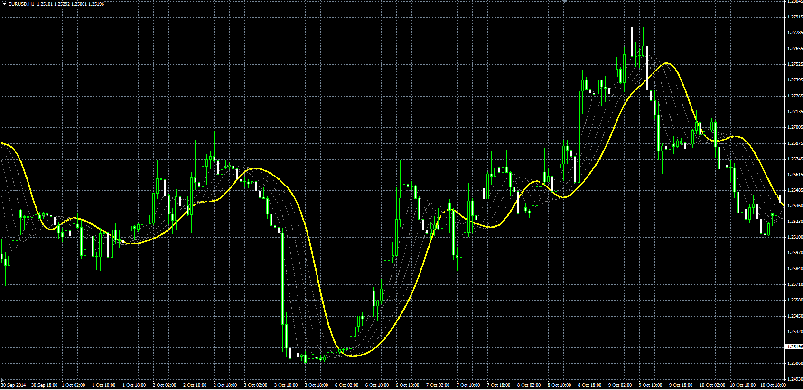

# Multiple smoothing moving Average

> Source: https://fxcodebase.com/code/viewtopic.php?f=38&t=61472  
> Forum: 38 · Topic 61472 · 1 post(s)

---

## Multiple smoothing moving Average

**Alexander.Gettinger** · Tue Nov 18, 2014 4:50 pm

Original LUA indicator: [viewtopic.php?f=17&t=15548](https://fxcodebase.com/code/viewtopic.php?f=17&t=15548).

> The indicator allows multiple smoothing the initial data.
> The user can choose the period and method of moving average,
> Number of repetitions.
> Each successive repetitions, using the data of previous step.

 

Download:

 [MSMA.mq4](files/97172/MSMA.mq4)
