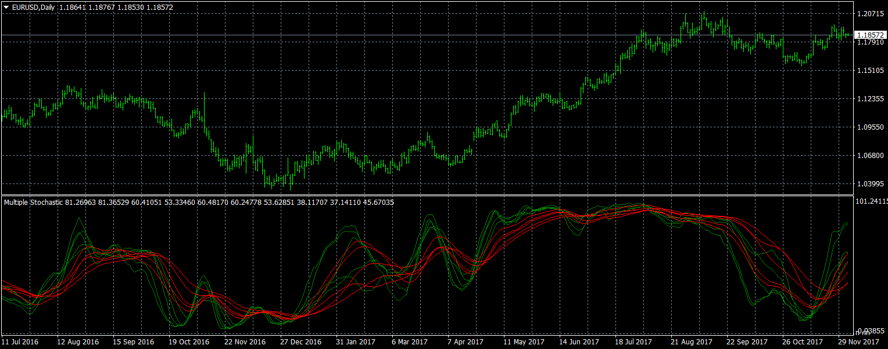

# Multiple Stochastic

> Source: https://fxcodebase.com/code/viewtopic.php?f=38&t=65435  
> Forum: 38 · Topic 65435 · 1 post(s)

---

## Multiple Stochastic

**Apprentice** · Tue Dec 05, 2017 5:17 am

TS2/Marketscope/Lua version
[viewtopic.php?f=17&t=65415](https://fxcodebase.com/code/viewtopic.php?f=17&t=65415)

 [Multiple Stochastic.mq4](files/116368/Multiple%20Stochastic.mq4)
