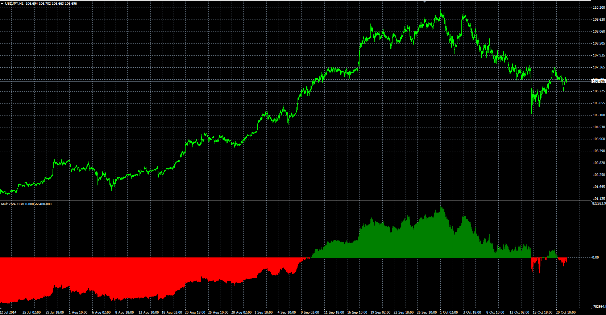

# MultiVote OBV oscillator

> Source: https://fxcodebase.com/code/viewtopic.php?f=38&t=61384  
> Forum: 38 · Topic 61384 · 1 post(s)

---

## MultiVote OBV oscillator

**Alexander.Gettinger** · Mon Oct 27, 2014 10:37 am

Original LUA oscillator: [viewtopic.php?f=17&t=24032](https://fxcodebase.com/code/viewtopic.php?f=17&t=24032).

> Original OBV only compares Closing Price.
> MVOVB takes into account all price components.
> This has resulted with higher sensitivity compared to the original.
>
> if HIGH >previous HIGH then HIGHVOTE =1
> if HIGH < previous HIGH then HIGHVOTE =-1
>
> if LOW >previous LOW then LOWVOTE =1
> if LOW < previous LOW then LOWVOTE =-1
>
> if CLOSE>previous CLOSE then CLOSEVOTE=1
> if CLOSE < previous CLOSE then CLOSEVOTE =-1
>
> TOTALVOTE = HIGHVOTE + LOWVOTE + CLOSEVOTE
> MVOBV = previousMVOBV + TOTALVOTE * Volume
> MVOBV = previousMVOBV + TOTALVOTE * Volume

 

Download:

 [MV_OVB.mq4](files/96757/MV_OVB.mq4)
