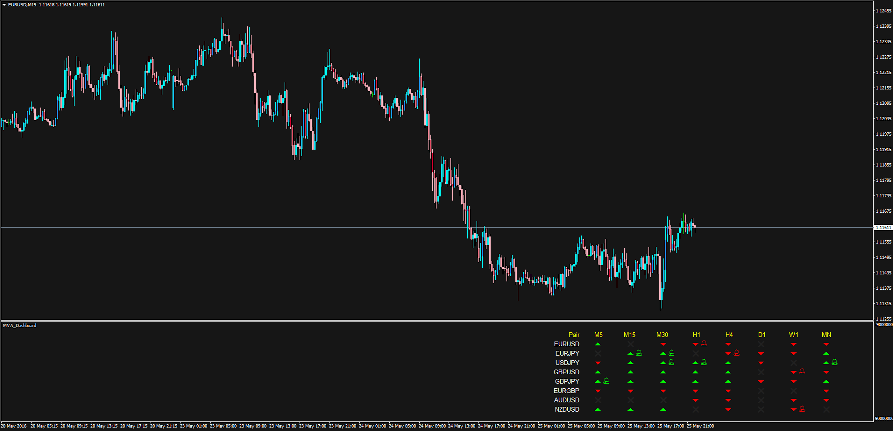

# MVA_Dashboard

> Source: https://fxcodebase.com/code/viewtopic.php?f=38&t=63528  
> Forum: 38 · Topic 63528 · 2 post(s)

---

## MVA_Dashboard

**Apprentice** · Thu May 26, 2016 1:27 am

Indicator analyze 3 simple MVA values (Short, Medium, Long)
Displays dashboard for specified set of currency pairs and periods.
The dashboard legenda is the following.
- Red arrow displayed if ShortMVA < MediumMVA < LongMVA
- Green arrow displayed if ShortMVA > MediumMVA > LongMVA
The bell sign is displayed next to the arrow if current price is between Short and Medium MVAs.
TEMA and DEMA methods included

 [#MVA_Dashboard.mq4](files/106476/MVA_Dashboard.mq4)

 [DEMA.mq4](files/106476/DEMA.mq4)

 [TEMA.mq4](files/106476/TEMA.mq4)

---

## Re: MVA_Dashboard

**sho-me-pips** · Mon Jan 23, 2017 10:13 am

I believe we could benefit from a small modification to this indicator.

Change the color of the arrow if the price is opposing the direction and outside all MVA.
As it is, the price can be moving opposite all MVA and still show up/down.

- **Green Down arrow** displayed if Price > (ShortMVA < MediumMVA < LongMVA)
- **Red Up arrow** displayed if Price <( ShortMVA > MediumMVA > LongMVA)
