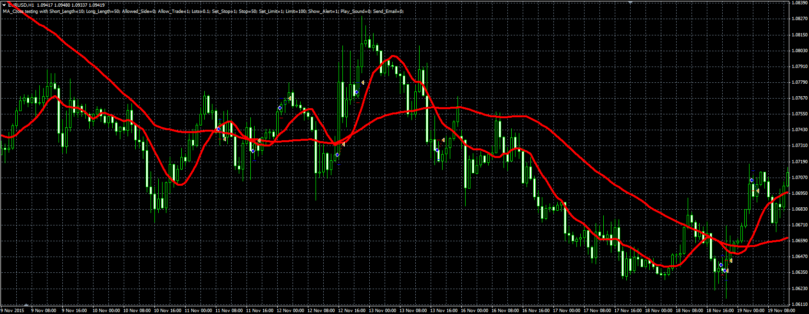

# MVA Difference Strategy

> Source: https://fxcodebase.com/code/viewtopic.php?f=38&t=62978  
> Forum: 38 · Topic 62978 · 1 post(s)

---

## MVA Difference Strategy

**Alexander.Gettinger** · Thu Dec 24, 2015 10:06 am

Buy and Sell signals are generated by simple MVA, Crossover.

 

Download:

 [MA_Cross.mq4](files/103993/MA_Cross.mq4)
