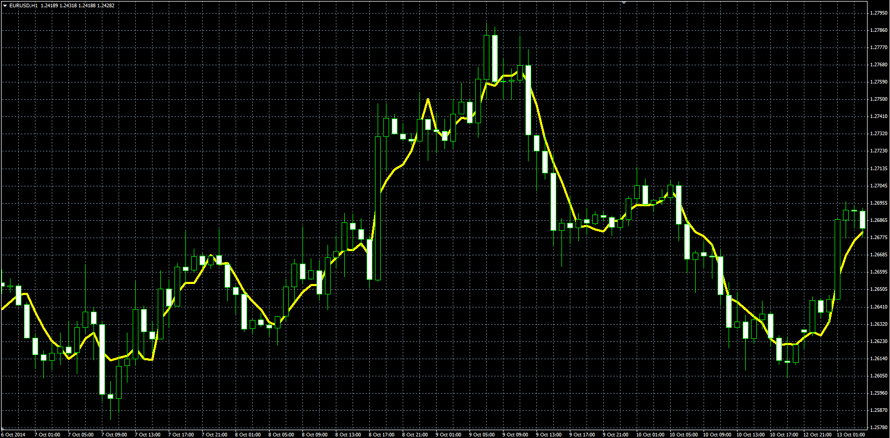

# MVA with Lag Reducing

> Source: https://fxcodebase.com/code/viewtopic.php?f=38&t=61537  
> Forum: 38 · Topic 61537 · 1 post(s)

---

## MVA with Lag Reducing

**Alexander.Gettinger** · Tue Nov 25, 2014 11:14 am

Original LUA indicator: [viewtopic.php?f=17&t=3993](https://fxcodebase.com/code/viewtopic.php?f=17&t=3993).

Formula:
MLR[i] = ((MVA[i]/MVA[i-1])^RL_Factor)*MVA[i], where
MVA - simple moving average with [Length] number of periods.

 

Download:

 [MVA_Lag_Reduce.mq4](files/97364/MVA_Lag_Reduce.mq4)
