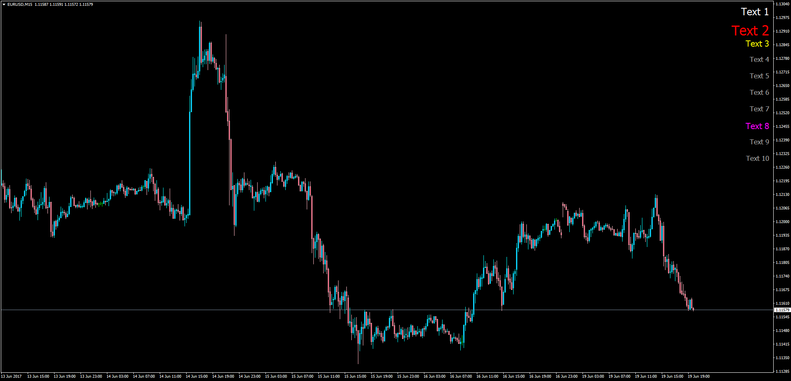

# My Note Book

> Source: https://fxcodebase.com/code/viewtopic.php?f=38&t=64812  
> Forum: 38 · Topic 64812 · 1 post(s)

---

## My Note Book

**Apprentice** · Tue Jun 20, 2017 11:03 am

Based on theTS2/lua original.
[viewtopic.php?f=17&t=64576](https://fxcodebase.com/code/viewtopic.php?f=17&t=64576)
Description:
MT4 request based on LUA Original. Will allow you do add up to 10 text labels to your chart. Font Type, sizes, colors, line separation customizable.

 [MyNoteBook.mq4](files/113006/MyNoteBook.mq4)
