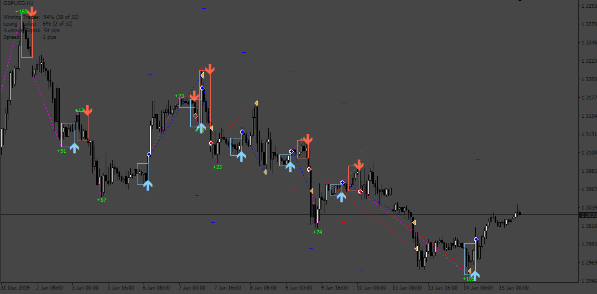
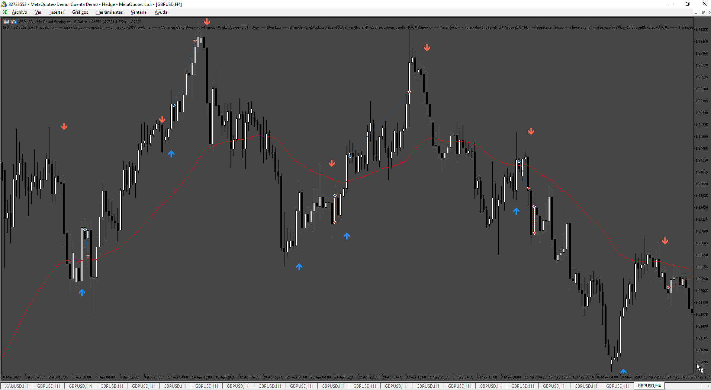

# mydayini_ea

> Source: https://fxcodebase.com/code/viewtopic.php?f=38&t=74932  
> Forum: 38 · Topic 74932 · 11 post(s)

---

## mydayini_ea

**Apprentice** · Thu May 30, 2024 2:44 pm

Based on the request.
[https://fxcodebase.com/code/viewtopic.php?f=38&t=74909](https://fxcodebase.com/code/viewtopic.php?f=38&t=74909)

 [mydayindi.mq4](files/155582/mydayindi.mq4)

 [mydayini_ea.mq4](files/155582/mydayini_ea.mq4)

---

## Re: mydayini_ea

**bigwomanrosie** · Thu May 30, 2024 6:41 pm

Thank you as always, if possible can we add take partials to this (at a specific amount of pips in profit close half of the position) and daily proift target (stops trading when at the profit level).

Backtesting results on this so far seems ok but alot of bad signals, need something to filter those but not sure what. Any other member has a suggestion feel free to post.

---

## Re: mydayini_ea

**bigwomanrosie** · Thu May 30, 2024 7:48 pm

For now, please add the ema 100/50 moving average.Need to study this some more.

---

## Re: mydayini_ea

**Apprentice** · Sun Jun 02, 2024 2:34 pm

As filter?
Can you define the rules?

---

## Re: mydayini_ea

**bigwomanrosie** · Tue Jun 04, 2024 12:18 pm

Sorry, yes as a filter. So if the buy candle signal close above the 50 exponential moving average we execute a buy and vice versa for a sell. Use a buffer or a percentage band around the moving average to avoid reacting to minor price fluctuations. For instance, only act on signals if the price moves 1-2% beyond the moving average This way we filter false signals).

---

## Re: mydayini_ea

**Apprentice** · Sat Jun 08, 2024 8:39 am

We have added your request to the development list.
Development reference 473

---

## Re: mydayini_ea

**bigwomanrosie** · Mon Jun 24, 2024 2:56 pm

Hi team/Apprentice

Any update on this one?

 Add the filter - So if the buy candle signal close above the 50 exponential moving average we execute a buy and vice versa for a sell. Use a buffer or a percentage band around the moving average to avoid reacting to minor price fluctuations. For instance, only act on signals if the price moves 1-2% beyond the moving average This way we filter false signals).

Add take partials.

---

## Re: mydayini_ea

**Apprentice** · Wed Jul 03, 2024 1:08 pm

[mydayini_ea_v2.mq4](files/155986/mydayini_ea_v2.mq4)

Try this version.

---

## Re: mydayini_ea

**bigwomanrosie** · Mon Jul 08, 2024 2:20 pm

Many thanks, can I have the mt5 please.

---

## Re: mydayini_ea

**Apprentice** · Sat Jul 13, 2024 2:06 am

We have added your request to the development list.
Development reference 569

---

## Re: mydayini_ea

**Apprentice** · Mon Aug 12, 2024 3:04 pm

 [MyDayIni_MT5.mq5](files/156410/MyDayIni_MT5.mq5)

 [MyDayIni_EA.mq5](files/156410/MyDayIni_EA.mq5)
